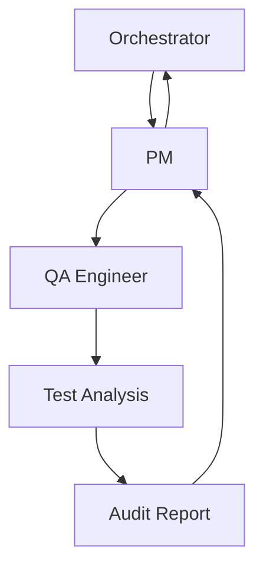

# QA Test Structure Audit Plan
**Date**: 2025-08-18  
**Orchestrator**: Claude Code  
**Objective**: Comprehensive audit of test directory structure and testing strategy

## Task Requirements
Create comprehensive qa-audit.md report at `.tmux_orchestrator/planning/2025-08-18T02-40-53-pre-commit-workflow/qa-audit.md`

### Audit Focus Areas
1. **Test Directory Structure Audit**
   - Analyze existing test organization
   - Document current test file locations
   - Assess directory hierarchy and naming conventions

2. **Test Coverage and Organization**
   - Evaluate test coverage across modules
   - Review test categorization (unit, integration, etc.)
   - Assess test file naming and structure consistency

3. **Test Execution Patterns**
   - Document current test execution workflows
   - Review test runner configurations
   - Analyze CI/CD test integration

4. **Testing Strategy Gaps**
   - Identify missing test coverage areas
   - Recommend testing strategy improvements
   - Suggest test organization enhancements

## Required Team Composition
- **Project Manager**: Coordinate audit execution and ensure deliverable quality
- **QA Engineer**: Perform detailed test structure analysis and create audit report

## Agent Interaction Pattern

## Individual Agent Briefings

### Project Manager
- Coordinate QA audit execution
- Ensure audit report meets requirements
- Report progress back to orchestrator
- Validate deliverable completeness

### QA Engineer
- Perform comprehensive test structure audit
- Create detailed qa-audit.md report
- Focus on all four specified audit areas
- Deliver report to specified location

## Deliverable
- Complete qa-audit.md report at `.tmux_orchestrator/planning/2025-08-18T02-40-53-pre-commit-workflow/qa-audit.md`
- Report must cover all four focus areas comprehensively

## Recovery Instructions
If QA Engineer fails:
1. Spawn replacement QA Engineer with same briefing
2. Continue audit from last documented progress
3. Ensure report completion and delivery