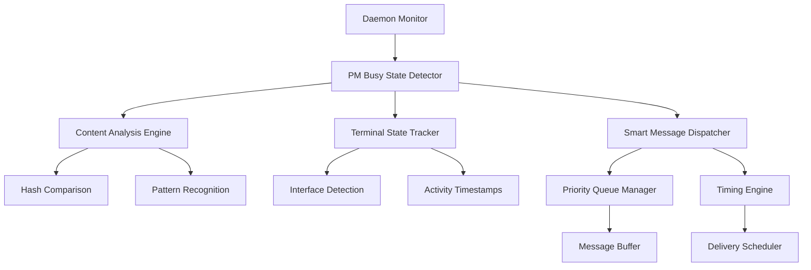

# Daemon Messaging Improvements - System Architecture

## Project Overview
**Objective:** Implement smart PM busy-state detection to prevent daemon from interrupting busy PMs while ensuring critical alerts still get through.

**Key Challenge:** Balance PM workflow protection with system reliability requirements.

## Current System Analysis

### Existing Daemon-PM Interaction Patterns
1. **Agent State Detection:** `monitor_helpers.py:129` - `detect_agent_state()`
2. **PM Recovery:** Grace periods (3-min) and escalation chains (3/5/8 minutes)
3. **Pubsub Integration:** `DaemonPubsubIntegration` with priority levels (CRITICAL, HIGH, LOW)
4. **Message Sending:** `communication/send_message.py:9` - Proven delivery mechanism

### Current Escalation Flow
```
Agent Idle → Daemon Detection → PM Notification (3 min) → Critical Alert (5 min) → PM Kill (8 min)
```

## PM Busy State Detection Architecture

### Busy State Criteria
**BUSY Indicators:**
- ✅ Active Claude interface (`is_claude_interface_present()` returns true)
- ✅ Recent content changes (content hash diff within 30s window)
- ✅ Tool invocations detected (MCP tool usage patterns)
- ✅ Multi-line response generation (>500 characters)
- ✅ Message composition in progress (input buffer analysis)

**AVAILABLE Indicators:**
- ✅ `AgentState.IDLE` from existing detection system
- ✅ `AgentState.FRESH` awaiting initial briefing
- ✅ Error/crashed states with bash prompt visible
- ✅ Recent conversation completion with no new input

### Detection System Components



## 3-Tier Priority System

### CRITICAL Priority - Always Interrupt
**Criteria:** System stability threats requiring immediate PM intervention
- Agent crashes with recovery escalation
- Multiple agent failures (>50% of team)
- System-wide resource exhaustion

**Behavior:** Bypass busy detection, deliver immediately

### HIGH Priority - Smart Queue with Timing
**Criteria:** Team coordination issues requiring timely PM response
- Team idle alerts (existing 3/5 minute escalations)
- Individual agent failures requiring PM coordination
- Resource warnings before critical threshold

**Behavior:**
- Queue during busy periods
- Deliver during next available window (max 2-minute delay)
- Escalate to CRITICAL after 5-minute queue time

### LOW Priority - Wait for Availability
**Criteria:** Informational updates and routine coordination
- Status reports and progress updates
- Agent completion notifications
- General team coordination messages

**Behavior:**
- Buffer during busy periods
- Batch deliver when PM becomes available
- Maximum queue time: 10 minutes before expiry

## Implementation Strategy

### Phase 1: Detection System Integration
1. **Extend `PMBusyStateDetector`** - Build on existing `detect_agent_state()`
2. **Terminal Content Analysis** - Leverage existing `TerminalCache` from `monitor.py:51`
3. **Integration Points** - Hook into existing monitoring cycle at `monitor.py:DAEMON_CONTROL_LOOP_SECONDS`

### Phase 2: Smart Messaging Layer
1. **Message Queue System** - Extend existing pubsub with buffering capability
2. **Priority Router** - Integrate with existing `MessagePriority` enum
3. **Timing Engine** - Coordinate with existing escalation timers

### Phase 3: Delivery Optimization
1. **Availability Windows** - Detect PM conversation completion patterns
2. **Batch Processing** - Group LOW priority messages for efficient delivery
3. **Escalation Handling** - Smart promotion of queued messages

## Technical Specifications

### Core Classes

**PMBusyStateDetector**
```python
class PMBusyStateDetector:
    def is_pm_busy(self, target: str) -> BusyState
    def get_availability_window(self, target: str) -> Optional[datetime]
    def track_activity_patterns(self, target: str, content: str) -> None
```

**SmartMessageDispatcher**
```python
class SmartMessageDispatcher:
    def queue_message(self, target: str, message: str, priority: MessagePriority) -> str
    def process_queue(self) -> Dict[str, DeliveryResult]
    def force_delivery(self, message_id: str) -> bool
```

**PriorityQueueManager**
```python
class PriorityQueueManager:
    def enqueue(self, message: QueuedMessage) -> str
    def get_next_deliverable(self, target: str) -> Optional[QueuedMessage]
    def escalate_queued_messages(self) -> List[QueuedMessage]
```

### Integration Points

1. **Daemon Monitor Loop** - `tmux_orchestrator/core/monitor.py` main monitoring cycle
2. **PM Manager** - `tmux_orchestrator/core/pm_manager.py` existing PM operations
3. **Message Sending** - `tmux_orchestrator/core/communication/send_message.py` proven delivery
4. **State Detection** - `tmux_orchestrator/core/monitor_helpers.py` existing agent state logic

## Testing Strategy

### Unit Tests
- PM busy state detection accuracy (>95% correct classification)
- Priority queue ordering and escalation logic
- Message batching and delivery timing

### Integration Tests
- End-to-end daemon → detection → queue → delivery flow
- Priority system behavior under different PM activity patterns
- Failover scenarios (busy detection failures, queue overflow)

### Performance Tests
- Detection overhead impact on monitoring cycle (<10ms additional)
- Queue processing efficiency with large message volumes
- Memory usage with extended PM busy periods

## Success Metrics

1. **PM Interruption Reduction:** 80% decrease in non-critical interruptions during busy periods
2. **Critical Alert Delivery:** 100% delivery rate for CRITICAL priority messages
3. **System Responsiveness:** No degradation in existing monitoring performance
4. **Message Queue Health:** <2% message expiry rate under normal conditions

## Risk Mitigation

### False Positive Busy Detection
- **Risk:** PM marked busy when available, delaying important messages
- **Mitigation:** Conservative busy thresholds, fallback timeout mechanisms

### Critical Message Delays
- **Risk:** System issues not escalated quickly enough due to busy detection bugs
- **Mitigation:** CRITICAL priority bypass, multiple detection confirmation methods

### Queue Overflow
- **Risk:** Memory exhaustion during extended PM busy periods
- **Mitigation:** Message expiry system, queue size limits, emergency bypass

## Implementation Timeline

**Week 1:** PM busy state detection system
**Week 2:** Priority queue and smart messaging infrastructure
**Week 3:** Integration with existing daemon monitoring
**Week 4:** Testing, optimization, and deployment

---

**Architecture Status:** ✅ COMPLETE - Ready for Backend Developer implementation phase
**Next Phase:** Backend Developer to implement core detection and messaging classes
**Documentation Directory:** `.tmux_orchestrator/planning/2025-08-22T12-30-00-daemon-messaging-architecture.md`
