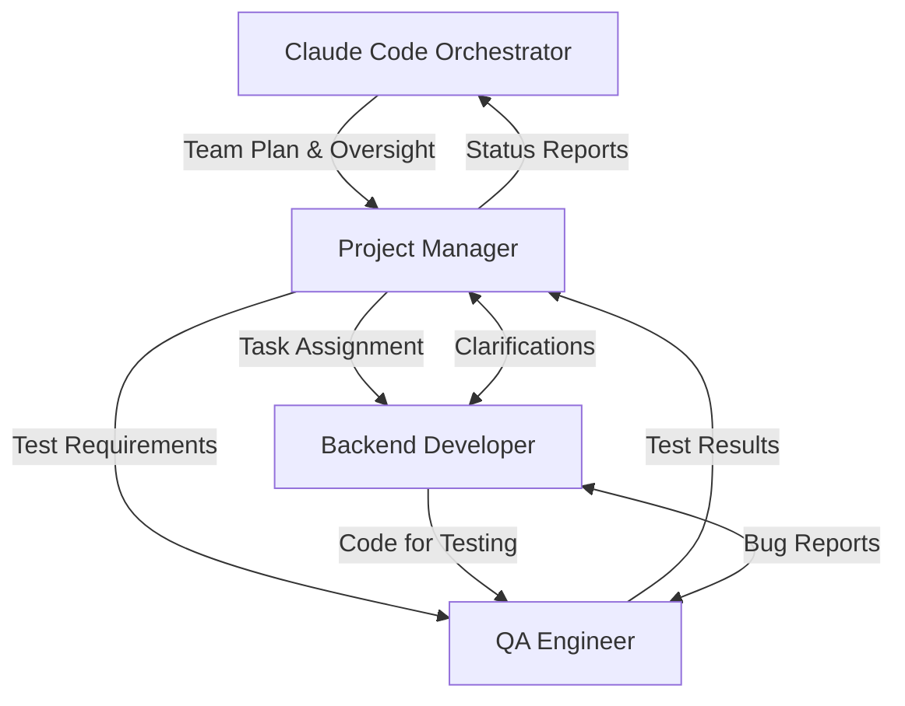

# Example Team Plan: Fix Tmux-Orchestrator Issues

## Project Overview
Fix critical issues identified in user feedback (v3-v5) to improve tmux-orchestrator reliability and usability.

## Team Composition

### Required Agents

1. **Project Manager** (Window 1)
   - Coordinate fixes across the codebase
   - Ensure quality gates and testing
   - Track progress on all issues
   - Report status back to orchestrator

2. **Senior Backend Developer** (Window 2)
   - Fix monitor auto-submission bug
   - Implement session attach command
   - Fix agent spawning reliability
   - Add bulk agent commands

3. **QA Engineer** (Window 3)
   - Test all fixes thoroughly
   - Create test scenarios for monitoring
   - Verify agent spawning works reliably
   - Document testing results

## Agent Briefings

### Project Manager Briefing
```
You are the Project Manager for fixing critical tmux-orchestrator issues. 

Your responsibilities:
1. Read the issues in /workspaces/Tmux-Orchestrator/feedback/tmux-orchestrator-feedback-v4.md and v5.md
2. Coordinate with the backend developer to implement fixes
3. Ensure the QA engineer tests everything thoroughly
4. Use tmux-orc commands to check on team members
5. Report progress to the orchestrator regularly

Key issues to address:
- Monitor detects idle agents but doesn't auto-submit messages
- Add tmux-orc session attach command
- Fix agent type showing as "Unknown"
- Improve agent spawning reliability

Quality standards:
- All code must have tests
- Linting must pass
- Changes must be backwards compatible
```

### Backend Developer Briefing
```
You are a Senior Backend Developer fixing critical tmux-orchestrator issues.

Your expertise:
- Python CLI development with Click
- Tmux automation and process management
- Error handling and retry logic
- System monitoring and daemons

Priority fixes:
1. Monitor auto-submission: When monitor detects "idle with Claude interface", send Enter key
2. Session attach command: Add tmux-orc session attach with auto-discovery
3. Agent spawning: Add retry logic and health checks
4. Bulk commands: Add --all flag to agent commands

Work with the PM for task prioritization and the QA engineer for testing.
```

### QA Engineer Briefing
```
You are a QA Engineer ensuring all tmux-orchestrator fixes work reliably.

Your responsibilities:
1. Create comprehensive test plans for each fix
2. Test monitor auto-submission with various scenarios
3. Verify session attach works with multiple sessions
4. Test agent spawning reliability (aim for >95% success)
5. Test bulk commands with 5+ agents

Document all test results and report issues to the PM immediately.
```

## Interaction Model



## Recovery Instructions

If any agent fails:
1. Check the last known state in tmux logs
2. Respawn using the same window number and briefing above
3. Have them read recent team communications to catch up
4. Continue from where they left off

## Success Criteria
- Monitor automatically submits stuck messages
- Session attach command works smoothly  
- Agent spawning succeeds >95% of the time
- Bulk commands work reliably
- All tests pass