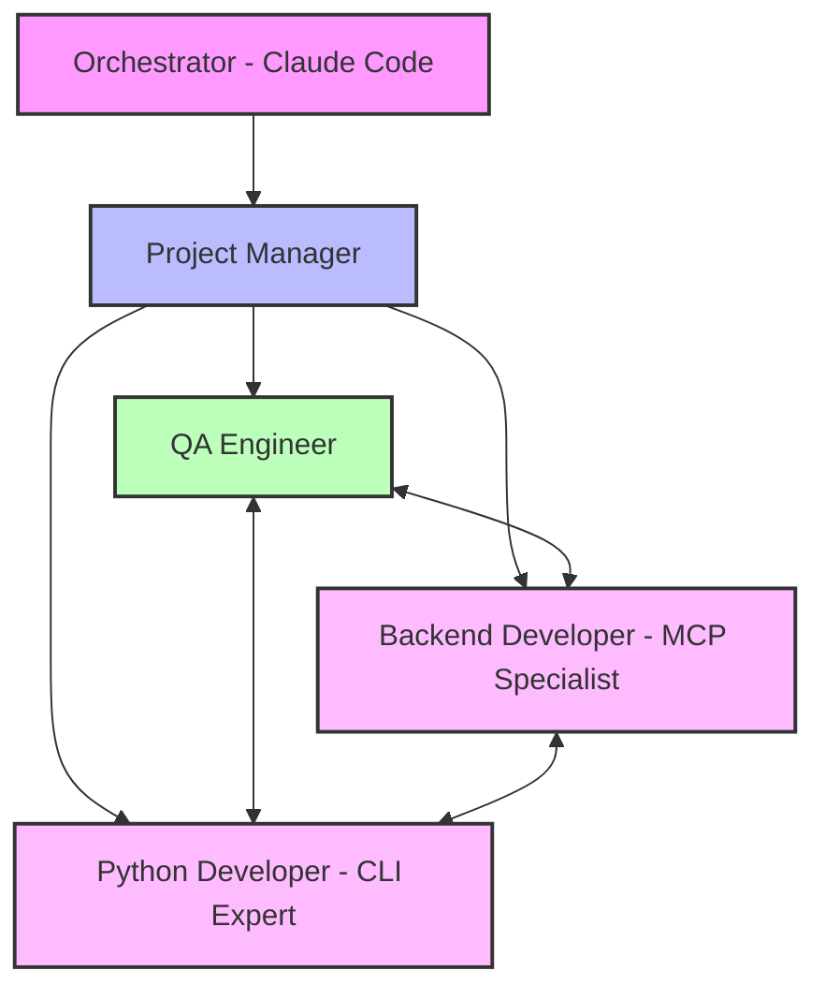

# MCP Core Fixes Team Plan

**Date**: 2025-08-24
**Orchestrator**: Claude Code
**Project**: Fix 5 Core MCP Issues for 100% CLI Parity

## Executive Summary

This plan outlines the team structure and execution strategy to fix 5 critical MCP server issues that are preventing 100% CLI parity. The issues are well-documented from 6+ test sessions, and we have a comprehensive test framework ready for validation.

## Team Structure

## Required Agents

### 1. Project Manager (PM)
**Session**: mcp-fixes:1
**Role**: Coordinate team, ensure systematic fixes, manage testing cycles
**Briefing**:
- Execute MCP core fixes plan from `.tmux_orchestrator/planning/mcp-core-fixes-team-plan.md`
- Coordinate between developers and QA for each fix
- Ensure zero regression and 100% success rate
- Use existing test framework from previous sessions
- Create project closeout when complete

### 2. QA Engineer
**Session**: mcp-fixes:2
**Role**: Test validation, regression testing, success metrics
**Briefing**:
- Set up test framework from `tests/test_mcp_integration.py`
- Run targeted tests after each developer fix
- Execute full regression suite after all fixes
- Document results with clear pass/fail status
- Validate 100% success rate achievement

### 3. Backend Developer - MCP Specialist
**Session**: mcp-fixes:3
**Role**: Fix MCP server issues 1, 2, and 5
**Briefing**:
- Fix empty kwargs handling in `tmux_orchestrator/mcp_server.py`
- Fix multi-word message parsing for agent communication
- Fix daemon blocking for long-running commands
- Coordinate with QA for immediate validation
- Maintain FastMCP framework compatibility

### 4. Python Developer - CLI Expert
**Session**: mcp-fixes:4
**Role**: Fix CLI-related issues 3 and 4
**Briefing**:
- Add --force flags for interactive confirmation commands
- Implement selective JSON flag logic
- Ensure backward compatibility
- Test CLI command structure thoroughly
- Work with Backend Dev on integration points

## Execution Plan

### Phase 1: Setup (30 minutes)
1. PM spawns team members with specific briefings
2. QA sets up test framework and prepares validation suite
3. Developers review MCP server code and plan fixes

### Phase 2: Fix Implementation (2-3 hours)
**Fix Order** (based on priority and dependencies):
1. **Issue 1**: Empty kwargs handling (Backend Dev)
2. **Issue 2**: Multi-word message parsing (Backend Dev)
3. **Issue 3**: Interactive confirmation flags (CLI Dev)
4. **Issue 4**: Selective JSON flag logic (CLI Dev)
5. **Issue 5**: Daemon blocking (Backend Dev)

**Process per fix**:
- Developer implements fix
- QA runs targeted tests
- Team addresses any issues
- Move to next fix only after validation

### Phase 3: Validation (30 minutes)
1. QA runs full regression test suite
2. Team addresses any regression issues
3. Final validation of 100% success rate
4. Documentation of all changes

### Phase 4: Closeout (15 minutes)
1. PM creates project closeout document
2. Team reviews success metrics
3. PM terminates team sessions

## Success Criteria

1. **All 5 core issues fixed**
2. **100% MCP-CLI parity achieved**
3. **Zero regression on working commands**
4. **Performance maintained <100ms**
5. **Clean test report showing all passes**

## Recovery Instructions

If any agent fails:
1. Check `.tmux_orchestrator/status/` for last known state
2. Spawn replacement with same briefing
3. Have them run `tmux-orc context show [role]` for rehydration
4. Continue from last validated checkpoint

## Resource References

- **MCP Server**: `tmux_orchestrator/mcp_server.py`
- **Test Framework**: `tests/test_mcp_integration.py`
- **Previous Results**: `tests/test_cli/MCP_VALIDATION_REPORT.md`
- **Briefing**: `.tmux_orchestrator/planning/2025-08-24T11-00-00-mcp-core-fixes/briefing.md`

## Communication Protocol

- Use `tmux-orc agent send` for direct messages
- QA broadcasts test results to team
- PM coordinates fix order and timing
- Developers notify QA when ready for testing

## Risk Mitigation

- **Backup MCP server** before changes
- **Test each fix individually** before moving on
- **Monitor for circular imports** or breaking changes
- **Keep changes minimal** and surgical

---

**Orchestrator Note**: This plan focuses on systematic execution of well-documented fixes. The team should achieve 100% success within 2-4 hours using the existing test framework.
