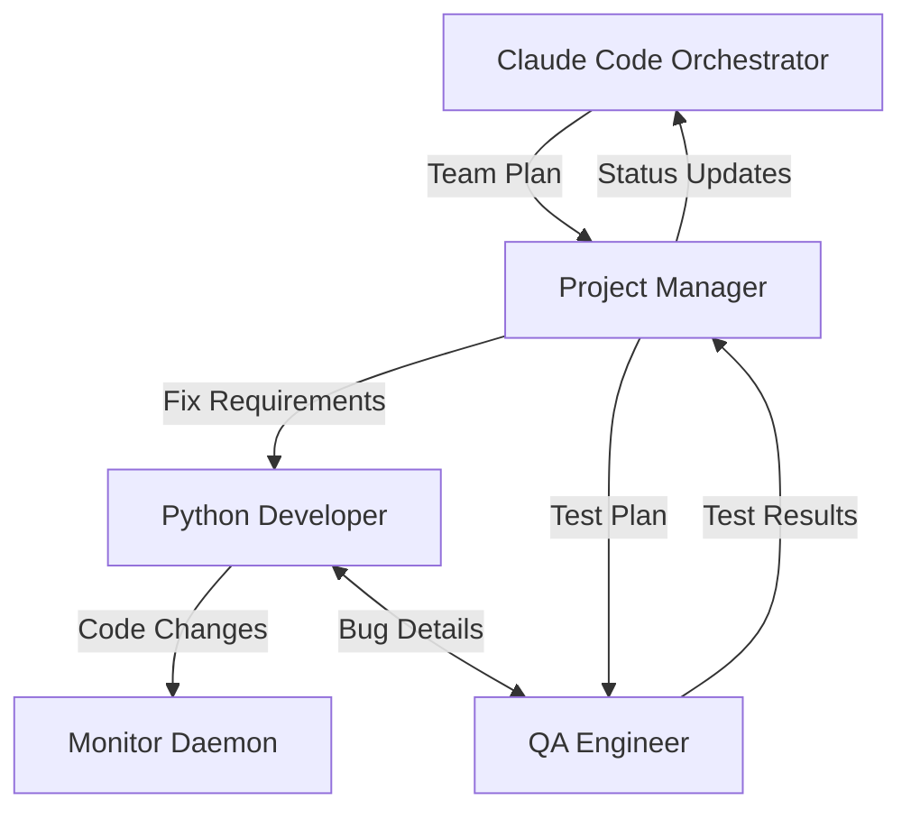

# Team Plan: Fix Monitor Auto-Submit Bug

## Project Overview
Fix the critical bug where the monitor detects "idle with Claude interface" but doesn't auto-submit stuck messages. This is the #1 blocker making the entire system unusable.

## Team Composition

### Required Agents

1. **Project Manager** (Window 1)
   - Read this plan and spawn the team
   - Coordinate the fix implementation
   - Test the solution thoroughly
   - Report progress to orchestrator

2. **Senior Python Developer** (Window 2)  
   - Expert in Python system programming
   - Fix the monitor auto-submit logic
   - Implement proper error handling
   - Add comprehensive logging

3. **QA Engineer** (Window 3)
   - Create test scenarios for stuck messages
   - Verify auto-submission works reliably
   - Test edge cases (multiple stuck agents, etc.)
   - Confirm no side effects

## Agent Briefings

### Project Manager Briefing
```
You are the Project Manager for fixing the critical monitor auto-submit bug.

Context: The monitor daemon correctly detects when agents have unsubmitted messages ("idle with Claude interface") but takes no action. This leaves agents stuck indefinitely.

Your responsibilities:
1. Read the bug details in /workspaces/Tmux-Orchestrator/feedback/tmux-orchestrator-feedback-v4.md (sections on monitor bug)
2. Spawn the development team using the briefings below
3. Guide the developer to implement the fix in tmux_orchestrator/core/monitor.py
4. Ensure comprehensive testing by QA
5. Report progress to orchestrator regularly

Key Requirements:
- When monitor detects "idle with Claude interface", it should send Enter key
- Log all auto-submission attempts
- Handle errors gracefully (don't crash monitor)
- Track submission attempts to avoid infinite loops

Quality Standards:
- Fix must be backwards compatible
- Comprehensive logging for debugging
- Thorough testing before declaring complete
```

### Senior Python Developer Briefing
```
You are a Senior Python Developer fixing the monitor auto-submit bug.

Context: The monitoring daemon detects idle Claude interfaces but doesn't submit stuck messages.

Your task:
1. Open /workspaces/Tmux-Orchestrator/tmux_orchestrator/core/monitor.py
2. Find where it detects "idle with Claude interface" 
3. Add logic to auto-submit the message:
   - Send Enter key using tmux.send_keys(target, "Enter")
   - Log the auto-submission attempt
   - Track attempts to prevent infinite loops
   - Handle errors gracefully

Key code location hints:
- Look for "idle with Claude interface" string
- The fix goes in the idle detection logic
- Use the existing tmux manager instance
- Add proper logging with self.logger

Example fix:
```python
if "idle with Claude interface" in status:
    # Auto-submit stuck message
    try:
        self.tmux.send_keys(target, "Enter")
        self.logger.info(f"Auto-submitted stuck message for {target}")
        # Track attempts to avoid loops
        if target not in self.submission_attempts:
            self.submission_attempts[target] = 0
        self.submission_attempts[target] += 1
    except Exception as e:
        self.logger.error(f"Failed to auto-submit for {target}: {e}")
```

Work with PM and QA to ensure the fix works properly.
```

### QA Engineer Briefing  
```
You are a QA Engineer ensuring the monitor auto-submit fix works reliably.

Your responsibilities:
1. Create test scenarios:
   - Single agent with stuck message
   - Multiple agents stuck simultaneously  
   - Agent that gets stuck repeatedly
   - Network/system delays

2. Test the fix thoroughly:
   - Verify messages get submitted
   - Check logs show auto-submission
   - Ensure no infinite loops
   - Confirm monitor stays stable

3. Document test results and any issues found

Testing approach:
- Create agents that get stuck intentionally
- Monitor the logs for auto-submission
- Verify agents become responsive
- Test error cases
```

## Interaction Model



## Success Criteria
- Monitor automatically submits stuck messages within 30 seconds
- Auto-submission is logged clearly
- No infinite loops or monitor crashes
- All test scenarios pass
- Stuck agents become responsive

## Recovery Instructions
If any agent fails:
1. Check their last output in tmux
2. Respawn with same window number and briefing
3. Have them read recent team messages
4. Continue from where they left off