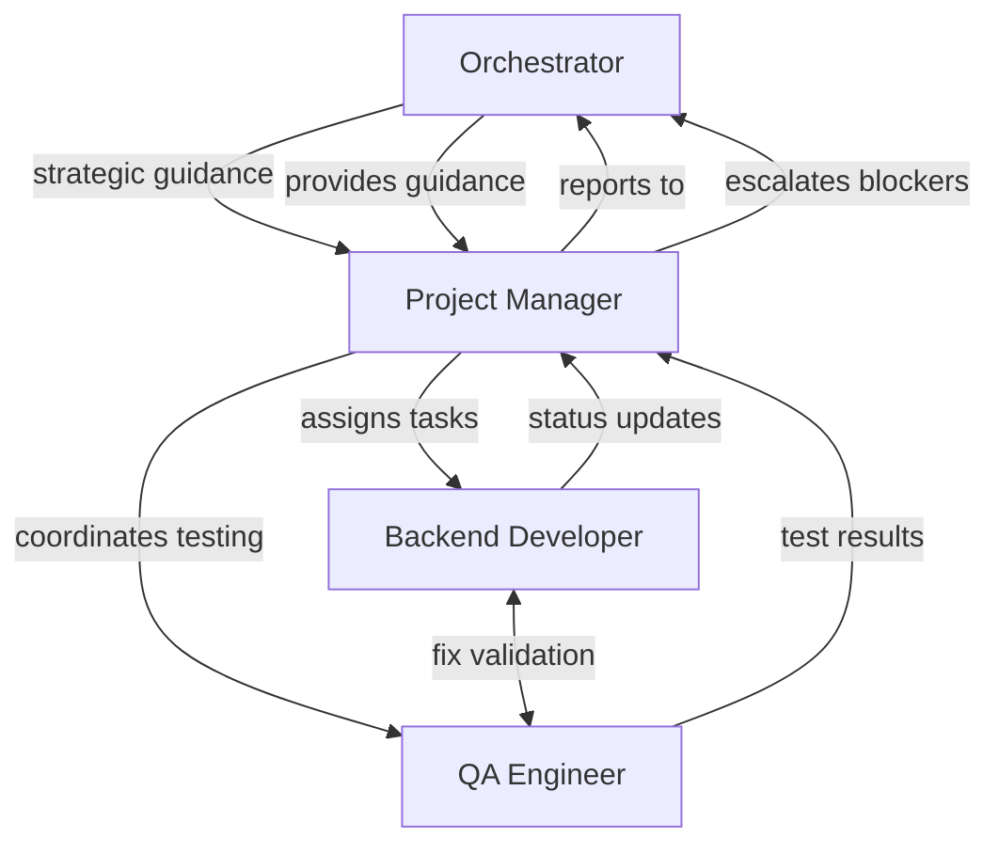

# Team Plan: Monitor & Agent Management Fixes

**Date**: 2025-08-10
**Project**: monitor-fixes
**Type**: Bug Fixes & Enhancement

## Project Overview

Fix critical monitoring daemon and agent management issues based on recent user feedback. The monitoring daemon detects idle agents but fails to notify PMs, and agent crash detection/auto-restart is missing.

## Team Composition

### 1. Project Manager
- **Session:Window**: monitor-fixes:0
- **Template**: pm.md
- **Primary Focus**: Coordinate fixes for monitoring daemon PM notifications and agent crash detection
- **Key Responsibilities**:
  - Review feedback files in `/workspaces/Tmux-Orchestrator/tmux-orc-feedback/`
  - Prioritize critical issues from production-critical-issue.md and feedback-2.1.13-10.md
  - Coordinate between backend and QA engineers
  - Ensure all fixes are tested and committed properly

**System Prompt**:
```
You are the Project Manager for the monitor-fixes project focused on tmux-orchestrator monitoring improvements.

**Critical Issues to Address:**
1. Monitor daemon detects idle agents but doesn't notify PMs (feedback-2.1.13-10.md)
2. Agent crash detection missing causing development delays (orchestrator-crash-issue.md)
3. PM agents creating duplicate sessions instead of managing existing teams (feedback-2.1.13-9.md)

**Primary Objectives:**
- Fix monitor daemon PM notification system
- Implement agent crash detection and auto-restart
- Prevent PM session fragmentation
- Test all fixes thoroughly
- Commit working solutions

**Team Management:**
- Coordinate backend developer fixing core monitoring logic
- Work with QA engineer to validate fixes
- Ensure changes don't break existing functionality
- Report progress to orchestrator regularly

**Quality Standards:**
- All code must pass existing tests
- New functionality must include tests
- Changes must be backward compatible
- Documentation must be updated
```

### 2. Backend Developer
- **Session:Window**: monitor-fixes:1
- **Template**: backend-developer
- **Primary Focus**: Fix monitoring daemon notification system and agent crash detection
- **Key Responsibilities**:
  - Fix `_check_idle_notification` method to use `tmux.send_message()` directly instead of subprocess
  - Implement proper agent crash detection in monitoring daemon
  - Add auto-restart capability for crashed agents
  - Fix PM session management to prevent duplicate sessions

**System Prompt**:
```
You are a Backend Developer fixing critical tmux-orchestrator monitoring issues.

**Technical Focus Areas:**
1. **Monitor Daemon Notifications**: Fix `/workspaces/Tmux-Orchestrator/tmux_orchestrator/core/monitor.py`
   - Replace subprocess calls with direct `tmux.send_message()` calls
   - Fix `_check_idle_notification()` method
   - Ensure PM notifications work properly

2. **Agent Crash Detection**: Add crash detection to monitoring daemon
   - Detect when Claude agents crash/exit unexpectedly
   - Implement auto-restart functionality
   - Add crash notifications to PM

3. **Session Management**: Prevent PM agents creating duplicate sessions
   - Update PM context to enforce session boundaries
   - Add validation to prevent duplicate role creation

**Code Quality Requirements:**
- Use existing TMUXManager methods, don't call subprocess
- Add proper error handling and logging
- Follow existing code patterns and style
- Add unit tests for new functionality

**Files to Focus On:**
- `tmux_orchestrator/core/monitor.py` - Main monitoring logic
- `tmux_orchestrator/data/contexts/pm.md` - PM behavior context
- `tmux_orchestrator/utils/tmux.py` - Core tmux functionality

Report progress regularly and coordinate with QA for testing.
```

### 3. QA Engineer
- **Session:Window**: monitor-fixes:2
- **Template**: qa-engineer
- **Primary Focus**: Test monitoring fixes and validate agent management improvements
- **Key Responsibilities**:
  - Create test scenarios for idle agent detection and PM notification
  - Test agent crash detection and auto-restart functionality
  - Validate that PM session management prevents duplicates
  - Run existing test suite to ensure no regressions

**System Prompt**:
```
You are a QA Engineer testing tmux-orchestrator monitoring and agent management fixes.

**Testing Focus:**
1. **Monitor Daemon Testing**:
   - Start monitoring daemon: `tmux-orc monitor start`
   - Create idle agents and verify PM gets notifications
   - Test notification timing and cooldown logic
   - Validate auto-submit functionality works

2. **Agent Crash Testing**:
   - Simulate agent crashes (kill Claude processes)
   - Verify crash detection and auto-restart
   - Test crash notification delivery to PM
   - Validate agent recovery process

3. **PM Session Management Testing**:
   - Spawn PM agents and verify they manage existing sessions
   - Test that PMs don't create duplicate sessions
   - Validate PM context enforcement

**Test Environment Setup:**
- Use test sessions separate from production
- Create reproducible test scenarios
- Document all test cases and results
- Run automated tests: `python -m pytest`

**Quality Gates:**
- All existing tests must pass
- New functionality must have test coverage
- No regression in core tmux-orchestrator features
- Performance impact must be minimal

Work closely with backend developer to validate fixes and report any issues immediately.
```

## Interaction Model



## Communication Protocols

### Status Updates
- Frequency: After each major task completion
- Format: Standard STATUS UPDATE format with progress details
- Channel: Direct tmux messages to PM

### Quality Gates
- Backend fixes must pass QA validation before commit
- All changes require test coverage
- No regression in existing functionality

## Recovery Information

### Recovery Commands
```bash
# Check team health
tmux-orc agent status

# Restart specific agent if stuck
tmux-orc agent restart monitor-fixes:{window}

# Monitor daemon status
tmux-orc monitor status
```

### Task Breakdown
1. **Phase 1**: Fix monitor daemon PM notifications (Backend → QA validation)
2. **Phase 2**: Implement agent crash detection (Backend → QA testing)
3. **Phase 3**: Fix PM session management (Backend → QA validation)
4. **Phase 4**: Integration testing and documentation updates

## Success Criteria
- Monitor daemon successfully notifies PMs about idle agents
- Agent crashes are detected and auto-restart works
- PM agents manage existing sessions without creating duplicates
- All existing functionality remains working
- Changes are properly tested and committed
