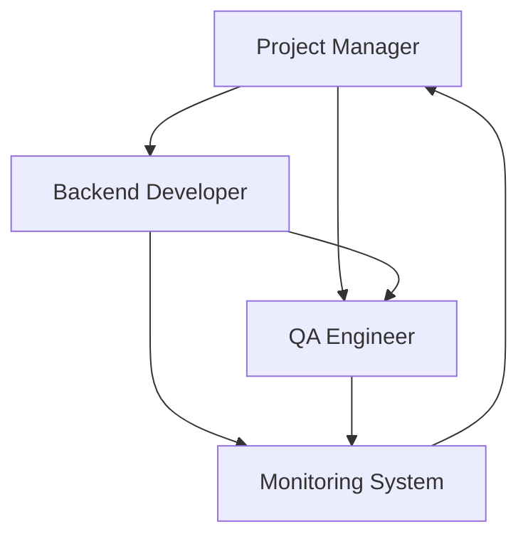

# Monitoring Fixes Team Plan

## Project Context
The Tmux Orchestrator monitoring system has been significantly improved with fixes for:
1. False positive crash detection caused by the @ symbol in bash prompts
2. Auto-submit functionality now correctly uses Enter key instead of complex key sequences
3. PM notification system verified working

However, the team was disrupted and needs to be rebuilt to continue improving the monitoring system.

## Team Requirements

### Project Manager (PM)
- **Session**: monitor-fixes:1
- **Role**: Coordinate the monitoring fixes team and ensure quality
- **Responsibilities**:
  - Monitor team member status
  - Respond to idle agent notifications
  - Coordinate testing of monitoring features
  - Ensure all code changes pass linting and tests
  - Manage PR creation when fixes are ready

### Backend Developer
- **Session**: monitor-fixes:3
- **Role**: Implement monitoring system improvements
- **Responsibilities**:
  - Enhance crash detection accuracy
  - Improve idle detection algorithms
  - Implement better recovery mechanisms
  - Add comprehensive logging
  - Fix any remaining edge cases

### QA Engineer
- **Session**: monitor-fixes:4
- **Role**: Test monitoring system reliability
- **Responsibilities**:
  - Create test scenarios for crash detection
  - Verify idle agent detection accuracy
  - Test PM notification delivery
  - Validate auto-recovery mechanisms
  - Document test results

## Current System Status

### Fixed Issues:
1. **False Positive Crash Detection**: The @ symbol in bash prompts no longer triggers false crash detections
2. **Auto-Submit**: Now uses simple Enter key instead of complex Ctrl+A/Ctrl+E sequences
3. **Error Detection**: Made more specific to avoid triggering on "Auto-update failed" messages

### Remaining Tasks:
1. Add more robust crash detection patterns
2. Implement cooldown periods for notifications
3. Enhance PM finding logic for multi-session environments
4. Add metrics collection for monitoring effectiveness
5. Create comprehensive test suite

## Team Interaction Flow



## Recovery Instructions

If any agent crashes:
1. The monitoring system will attempt auto-recovery
2. If auto-recovery fails, PM will be notified
3. PM should manually restart the agent using:
   ```bash
   tmux send-keys -t [target] 'claude --dangerously-skip-permissions' Enter
   ```
4. Re-brief the agent on their current tasks

## Success Criteria
- Zero false positive crash detections
- 100% accurate idle agent detection
- Reliable PM notifications within 10 seconds
- Successful auto-recovery for 90% of crashes
- All code changes pass linting and tests
