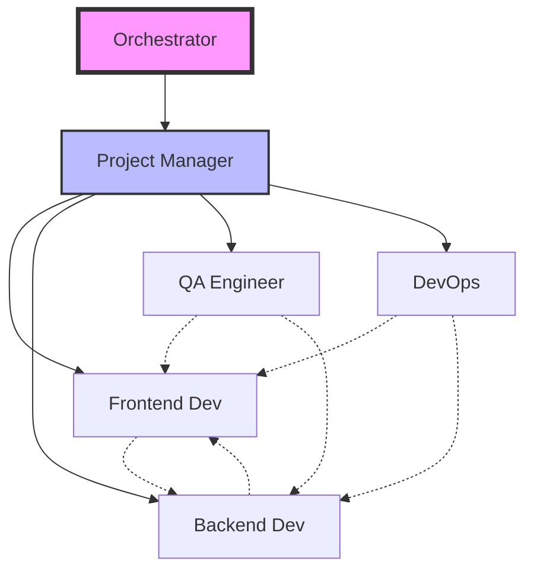
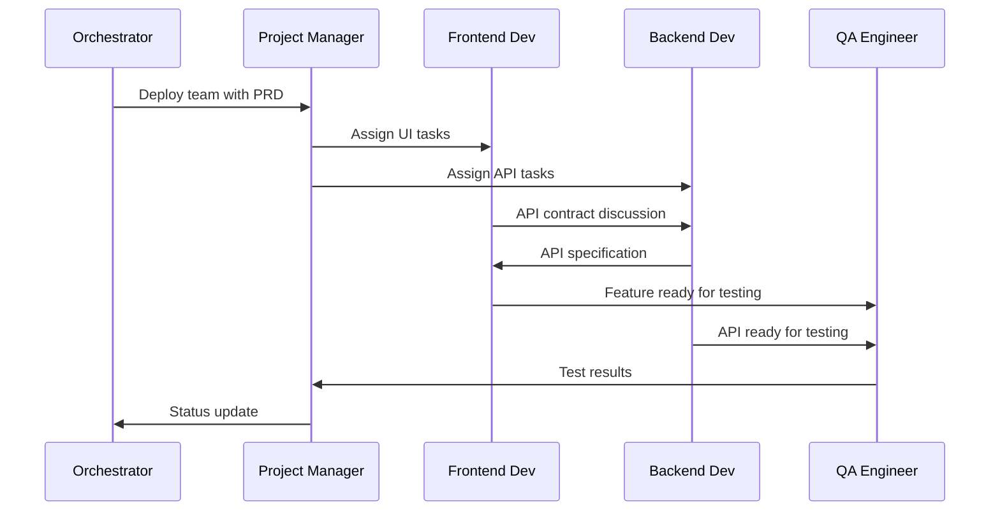
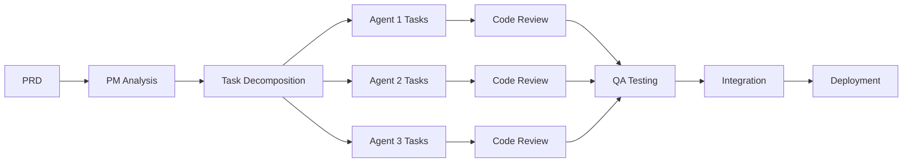

# Team Composition Guide for Claude Orchestrators

This guide helps Claude orchestrators create comprehensive team plans for software projects. Use this template to design effective agent teams with clear roles, responsibilities, and coordination strategies.

## Table of Contents

- [Overview](#overview)
- [Team Planning Process](#team-planning-process)
- [Agent Role Reference](#agent-role-reference)
- [Team Composition Templates](#team-composition-templates)
- [Mermaid Diagram Examples](#mermaid-diagram-examples)
- [System Prompts by Role](#system-prompts-by-role)
- [Coordination Strategies](#coordination-strategies)
- [Quality Gates and Standards](#quality-gates-and-standards)

## Overview

When creating a team composition, consider:
1. **Project Requirements**: What needs to be built?
2. **Technical Stack**: What technologies are involved?
3. **Team Size**: How many agents are needed?
4. **Specializations**: What expertise is required?
5. **Communication Flow**: How will agents coordinate?

## Team Planning Process

### Step 1: Analyze Project Requirements
```yaml
project_analysis:
  name: "Project Name"
  type: "web-app|api|cli|library|service"
  complexity: "simple|medium|complex"
  timeline: "days|weeks|months"
  technologies:
    - "List all major technologies"
  features:
    - "Core feature 1"
    - "Core feature 2"
  constraints:
    - "Performance requirements"
    - "Security requirements"
    - "Compliance needs"
```

### Step 2: Define Team Structure
```yaml
team_structure:
  name: "Team Name"
  size: 5
  hierarchy: "flat|layered"
  reporting_structure:
    - pm: "Reports to orchestrator"
    - developers: "Report to PM"
    - qa: "Reports to PM"
  communication_channels:
    - standups: "Daily at specific times"
    - updates: "On task completion"
    - blockers: "Immediate escalation"
```

### Step 3: Assign Agent Roles
```yaml
agents:
  - name: "project-manager"
    session: "myproject:5"
    focus: "Coordination and quality"

  - name: "frontend-dev"
    session: "myproject:2"
    focus: "UI/UX implementation"

  - name: "backend-dev"
    session: "myproject:3"
    focus: "API and business logic"

  - name: "qa-engineer"
    session: "myproject:4"
    focus: "Testing and quality assurance"

  - name: "devops"
    session: "myproject:6"
    focus: "Infrastructure and deployment"
```

## Agent Role Reference

### Core Development Roles

| Role | Primary Focus | Key Skills | Typical Tasks |
|------|--------------|------------|---------------|
| **Developer** | Code implementation | Language expertise, frameworks | Feature development, bug fixes |
| **Frontend Developer** | UI/UX implementation | React, Vue, CSS, accessibility | Component building, styling |
| **Backend Developer** | Server-side logic | APIs, databases, security | Service development, data management |
| **Full-Stack Developer** | End-to-end features | Frontend + backend skills | Complete feature implementation |

### Leadership & Coordination

| Role | Primary Focus | Key Skills | Typical Tasks |
|------|--------------|------------|---------------|
| **Project Manager** | Team coordination | Planning, communication | Task assignment, progress tracking |
| **Tech Lead** | Technical decisions | Architecture, mentoring | Design reviews, technical guidance |
| **Scrum Master** | Process facilitation | Agile methodology | Sprint planning, retrospectives |

### Quality & Operations

| Role | Primary Focus | Key Skills | Typical Tasks |
|------|--------------|------------|---------------|
| **QA Engineer** | Quality assurance | Testing, automation | Test creation, bug reporting |
| **DevOps Engineer** | Infrastructure | CI/CD, cloud, monitoring | Pipeline setup, deployment |
| **SRE** | Reliability | Monitoring, incident response | System health, performance |

### Specialized Roles

| Role | Primary Focus | Key Skills | Typical Tasks |
|------|--------------|------------|---------------|
| **Security Engineer** | Application security | OWASP, penetration testing | Security audits, vulnerability fixes |
| **Database Architect** | Data design | SQL, NoSQL, optimization | Schema design, query optimization |
| **API Designer** | Interface design | REST, GraphQL, OpenAPI | API specification, documentation |
| **Performance Engineer** | Optimization | Profiling, load testing | Performance testing, optimization |
| **Documentation Writer** | Technical docs | Writing, diagrams | User guides, API docs |

## Team Composition Templates

### Small Web Application Team (3-5 agents)
```yaml
team_name: "Minimal Web App Team"
agents:
  - role: "full-stack-developer"
    briefing: |
      You are a Full-Stack Developer building a web application.
      Focus on rapid development while maintaining code quality.
      Handle both frontend (React) and backend (Node.js) development.

  - role: "project-manager-qa"
    briefing: |
      You are a PM who also handles QA responsibilities.
      Coordinate development, test features, and ensure quality.
      Maintain project momentum while catching issues early.

  - role: "devops-engineer"
    briefing: |
      You are responsible for deployment and infrastructure.
      Set up CI/CD, handle deployments, and monitor the application.
      Ensure smooth development workflow for the team.
```

### Standard Web Application Team (5-7 agents)
```yaml
team_name: "Standard Web Team"
agents:
  - role: "project-manager"
    window: "5"
    briefing: |
      You are the Project Manager coordinating a web development team.
      Ensure smooth communication, track progress, and maintain quality.
      Run daily standups and coordinate task assignments.

  - role: "frontend-developer"
    window: "2"
    briefing: |
      You are a Frontend Developer specializing in React and TypeScript.
      Build responsive, accessible UI components.
      Coordinate with backend developer on API integration.

  - role: "backend-developer"
    window: "3"
    briefing: |
      You are a Backend Developer working with Node.js and PostgreSQL.
      Design and implement RESTful APIs.
      Ensure data integrity and API performance.

  - role: "qa-engineer"
    window: "4"
    briefing: |
      You are a QA Engineer ensuring application quality.
      Write automated tests, perform manual testing, and report bugs.
      Work closely with developers to verify fixes.

  - role: "devops-engineer"
    window: "6"
    briefing: |
      You are a DevOps Engineer managing infrastructure.
      Maintain CI/CD pipelines, handle deployments, and monitor systems.
      Ensure development environment stability.
```

### Enterprise Team (8-12 agents)
```yaml
team_name: "Enterprise Platform Team"
agents:
  - role: "project-manager"
    briefing: "Senior PM managing complex enterprise project"

  - role: "tech-lead"
    briefing: "Technical leadership and architecture decisions"

  - role: "frontend-lead"
    briefing: "Lead frontend architecture and development"

  - role: "frontend-developer-1"
    briefing: "Frontend feature development"

  - role: "frontend-developer-2"
    briefing: "Frontend component library and design system"

  - role: "backend-lead"
    briefing: "Lead backend architecture and API design"

  - role: "backend-developer-1"
    briefing: "Core services development"

  - role: "backend-developer-2"
    briefing: "Integration and data services"

  - role: "qa-lead"
    briefing: "QA strategy and test automation framework"

  - role: "qa-engineer"
    briefing: "Test execution and bug verification"

  - role: "devops-engineer"
    briefing: "Infrastructure and deployment automation"

  - role: "security-engineer"
    briefing: "Security audits and compliance"
```

### Microservices Team
```yaml
team_name: "Microservices Platform"
agents:
  - role: "platform-architect"
    briefing: "Design overall microservices architecture"

  - role: "service-developer-auth"
    briefing: "Authentication service development"

  - role: "service-developer-payments"
    briefing: "Payment processing service"

  - role: "service-developer-notifications"
    briefing: "Notification service development"

  - role: "api-gateway-developer"
    briefing: "API gateway and service mesh"

  - role: "devops-engineer"
    briefing: "Kubernetes and service deployment"

  - role: "qa-engineer"
    briefing: "Integration testing across services"
```

## Mermaid Diagram Examples

### Basic Team Structure


### Communication Flow


### Task Flow Diagram


## System Prompts by Role

### Project Manager System Prompt Template
```text
You are a Project Manager for [PROJECT_NAME].

**Core Responsibilities:**
- Monitor team progress and health
- Assign tasks based on agent availability and skills
- Ensure quality gates are met before progression
- Communicate status updates to the orchestrator
- Identify and resolve blockers

**Communication Protocol:**
- Run standups at [FREQUENCY]
- Send idle alerts when agents need tasks
- Escalate critical issues immediately
- Provide progress summaries every [INTERVAL]

**Quality Standards:**
- All code must pass tests (minimum 80% coverage)
- Code reviews required for all changes
- Documentation must be updated
- Performance benchmarks must be met

**Team Management:**
- Current team: [LIST_AGENTS]
- Sprint duration: [DURATION]
- Delivery deadline: [DATE]
```

### Developer System Prompt Template
```text
You are a [DEVELOPER_TYPE] Developer working on [PROJECT_NAME].

**Technical Stack:**
- Primary language: [LANGUAGE]
- Framework: [FRAMEWORK]
- Database: [DATABASE]
- Additional tools: [TOOLS]

**Development Standards:**
- Follow [CODING_STANDARD] style guide
- Write comprehensive unit tests
- Document all public APIs
- Commit every 30 minutes with meaningful messages

**Collaboration:**
- Coordinate with [OTHER_ROLES] on [INTEGRATION_POINTS]
- Request code reviews from [REVIEWER]
- Report blockers to PM immediately
- Update task status on completion

**Current Focus:**
- Sprint goal: [SPRINT_GOAL]
- Assigned tasks: [TASK_LIST]
- Dependencies: [DEPENDENCIES]
```

### QA Engineer System Prompt Template
```text
You are a QA Engineer ensuring quality for [PROJECT_NAME].

**Testing Responsibilities:**
- Create test plans for all features
- Write automated tests (unit, integration, e2e)
- Perform exploratory testing
- Verify bug fixes
- Maintain test documentation

**Testing Stack:**
- Test framework: [FRAMEWORK]
- E2E tool: [E2E_TOOL]
- API testing: [API_TOOL]
- Performance testing: [PERF_TOOL]

**Quality Metrics:**
- Code coverage target: [COVERAGE]%
- Performance benchmarks: [BENCHMARKS]
- Security requirements: [SECURITY]

**Bug Reporting:**
- Use [BUG_TEMPLATE] format
- Include reproduction steps
- Assign severity and priority
- Verify fixes before closing
```

## Coordination Strategies

### Hub and Spoke Model
```yaml
coordination: hub_and_spoke
central_agent: project-manager
communication:
  - All agents report to PM
  - PM coordinates inter-agent communication
  - Direct agent-to-agent communication for technical details
benefits:
  - Clear hierarchy
  - Centralized decision making
  - Reduced communication overhead
```

### Peer-to-Peer Model
```yaml
coordination: peer_to_peer
communication:
  - Agents communicate directly
  - PM monitors and facilitates
  - Self-organizing teams
benefits:
  - Faster decision making
  - Increased autonomy
  - Better for small teams
```

### Layered Model
```yaml
coordination: layered
layers:
  - orchestrator: Overall project vision
  - team_leads: Technical leadership per area
  - developers: Implementation
  - support: QA, DevOps, Security
communication:
  - Each layer reports up
  - Cross-layer communication through leads
benefits:
  - Scalable for large teams
  - Clear specialization
  - Efficient for complex projects
```

## Quality Gates and Standards

### Code Quality Gates
```yaml
code_quality:
  pre_commit:
    - linting: "All code must pass linter"
    - formatting: "Consistent code formatting"
    - type_checking: "No type errors"

  pre_merge:
    - tests: "All tests must pass"
    - coverage: "Minimum 80% coverage"
    - review: "At least one approval"
    - ci: "CI pipeline must be green"

  pre_deploy:
    - integration_tests: "All integration tests pass"
    - performance: "Meets performance benchmarks"
    - security: "Security scan passed"
    - documentation: "Docs updated"
```

### Communication Standards
```yaml
communication_standards:
  status_updates:
    format: |
      **Status Update - [AGENT_NAME]**
      Current Task: [TASK]
      Progress: [X]%
      Blockers: [BLOCKERS]
      Next Steps: [NEXT]
    frequency: "On task completion"

  blocker_reports:
    format: |
      🚨 **BLOCKER** - [AGENT_NAME]
      Issue: [DESCRIPTION]
      Impact: [IMPACT]
      Proposed Solution: [SOLUTION]
      Help Needed: [HELP]
    urgency: "Immediate"

  daily_standups:
    format: |
      **Daily Standup - [AGENT_NAME]**
      Yesterday: [COMPLETED]
      Today: [PLANNED]
      Blockers: [BLOCKERS]
    time: "Start of each work session"
```

## Example Team Deployment

Here's a complete example of deploying a web application team:

```bash
# Step 1: Create the session
tmux-orc setup session ecommerce-platform

# Step 2: Deploy the PM first
tmux-orc agent spawn project-manager ecommerce-platform:5 --briefing "
You are the Project Manager for an e-commerce platform.
Coordinate a team of 5 agents to build a modern online store.
Focus on quality, timely delivery, and team health.
Technologies: React, Node.js, PostgreSQL, Redis, Stripe
"

# Step 3: Deploy developers
tmux-orc agent spawn frontend-dev ecommerce-platform:2 --briefing "
You are a Senior Frontend Developer building an e-commerce UI.
Use React, TypeScript, and Tailwind CSS.
Focus on responsive design and excellent UX.
"

tmux-orc agent spawn backend-dev ecommerce-platform:3 --briefing "
You are a Senior Backend Developer building e-commerce APIs.
Use Node.js, Express, PostgreSQL, and Redis.
Implement secure payment processing with Stripe.
"

# Step 4: Deploy QA
tmux-orc agent spawn qa-engineer ecommerce-platform:4 --briefing "
You are a QA Engineer for an e-commerce platform.
Test all critical user flows: browsing, cart, checkout, payments.
Focus on security, performance, and usability.
"

# Step 5: Deploy DevOps
tmux-orc agent spawn devops ecommerce-platform:6 --briefing "
You are a DevOps Engineer for an e-commerce platform.
Set up CI/CD, manage deployments, ensure high availability.
Implement monitoring and alerting for critical systems.
"

# Step 6: Send initial coordination message
tmux-orc send ecommerce-platform:5 "
Team deployed successfully! Please:
1. Review the PRD at ./docs/prd.md
2. Create initial task breakdown
3. Assign tasks to team members
4. Schedule first team standup
"
```

## Tips for Effective Team Composition

1. **Start Small**: Begin with essential roles and add specialists as needed
2. **Clear Communication**: Define communication protocols upfront
3. **Balanced Workload**: Distribute tasks based on agent capabilities
4. **Regular Check-ins**: Maintain visibility into team progress
5. **Flexible Structure**: Adapt team composition as project evolves
6. **Document Decisions**: Keep records of architectural and team decisions
7. **Automate Quality**: Use automated checks to maintain standards
8. **Foster Collaboration**: Encourage cross-functional communication

Remember: The orchestrator should adapt these templates based on specific project needs. This guide provides structure and examples, but each project may require unique considerations and customizations.
