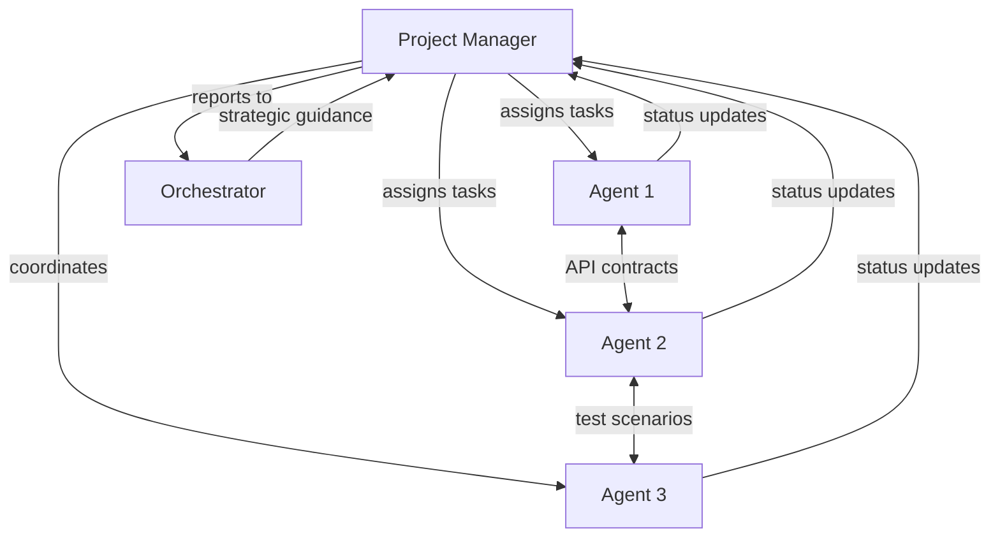

# Team Composition - {Project Name}

Generated: {Date}
PRD: {PRD Location}
Project Type: {Type}

## Team Overview

This document defines the agent team composition for the {project name} project. The team has been customized based on the project requirements identified in the PRD.

## Team Rationale

{Explain why this specific team composition was chosen, what project aspects drove the decisions}

## Team Members

### 1. Project Manager
- **Session:Window**: {project}:0
- **Template**: project-manager.yaml
- **Customizations**: {Any project-specific adjustments}
- **Primary Focus**: {Specific PM focus for this project}

### 2. {Agent Role 1}
- **Session:Window**: {project}:1
- **Template**: {template-name}.yaml
- **Customizations**: {Project-specific adjustments}
- **Primary Focus**: {What this agent will focus on}
- **Key Responsibilities**:
  - {Responsibility 1}
  - {Responsibility 2}
  - {Responsibility 3}

### 3. {Agent Role 2}
- **Session:Window**: {project}:2
- **Template**: {template-name}.yaml
- **Customizations**: {Project-specific adjustments}
- **Primary Focus**: {What this agent will focus on}
- **Key Responsibilities**:
  - {Responsibility 1}
  - {Responsibility 2}
  - {Responsibility 3}

{Continue for all team members...}

## Interaction Model



## Communication Protocols

### Status Updates
- Frequency: After each task completion
- Format: Standard STATUS UPDATE format
- Channel: tmux-orc publish --session pm:0

### Cross-Agent Communication
- {Agent1} ↔ {Agent2}: {Purpose of communication}
- {Agent2} ↔ {Agent3}: {Purpose of communication}

### Escalation Path
1. Agent → PM: Technical blockers, clarifications
2. PM → Orchestrator: Resource needs, strategic decisions
3. Orchestrator → User: Major issues, approvals needed

## Quality Gates

Each agent must meet these project-specific quality standards:

### Code Quality
- {Project-specific quality requirement 1}
- {Project-specific quality requirement 2}
- All standard quality gates (tests, linting, etc.)

### Documentation
- {Documentation requirement 1}
- {Documentation requirement 2}

### Security
- {Security requirement if applicable}

## Recovery Information

In case of agent failure, use this information to recover:

### System Prompts Location
All agent prompts are derived from:
- Base template: `.tmux_orchestrator/agent-templates/{template}.yaml`
- Project customizations: This document
- Task assignments: `.tmux_orchestrator/projects/{project}/agents/`

### Recovery Commands
```bash
# Check agent health
tmux-orc recovery check --session {project}

# Restart specific agent
tmux-orc agent restart {project}:{window}

# Re-brief agent after restart
tmux-orc agent brief {project}:{window} --template {template}
```

### Critical Context
{Any critical project context that agents need after recovery}

## Task Distribution Strategy

- **{Agent 1}**: {Percentage}% of tasks, focusing on {area}
- **{Agent 2}**: {Percentage}% of tasks, focusing on {area}
- **{Agent 3}**: {Percentage}% of tasks, focusing on {area}

## Success Metrics

The team will be measured on:
1. {Metric 1}
2. {Metric 2}
3. {Metric 3}

## Notes

{Any additional notes about team composition, special considerations, etc.}
