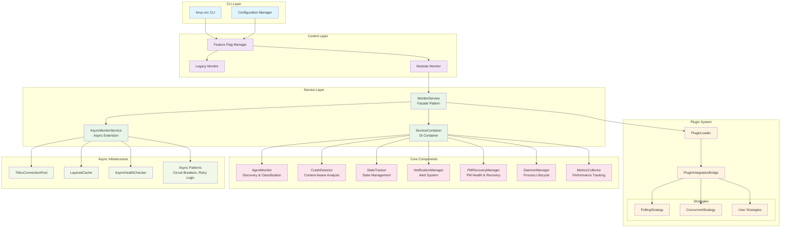
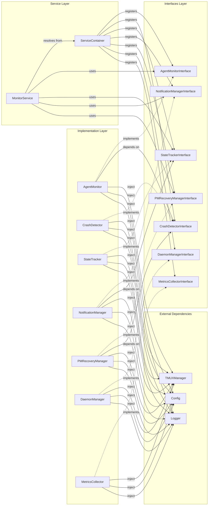
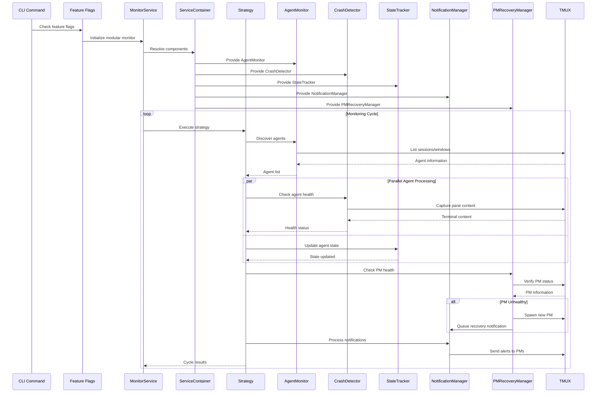
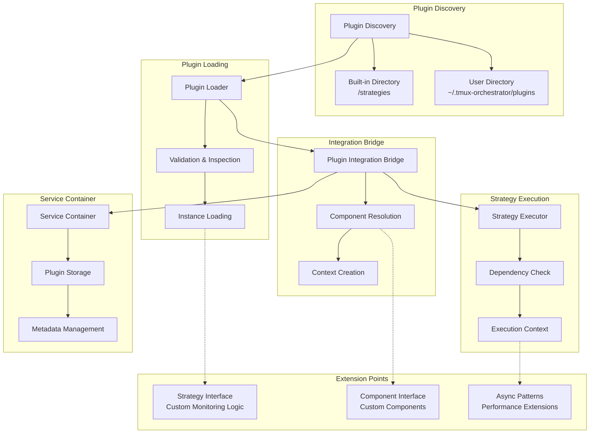

# Tmux Orchestrator Development Guide

## Table of Contents
- [Overview](#overview)
- [Architecture Diagrams](#architecture-diagrams)
- [Core Components](#core-components)
- [Dependency Injection](#dependency-injection)
- [Plugin Architecture](#plugin-architecture)
- [Adding New Features](#adding-new-features)
- [Testing Strategies](#testing-strategies)
- [Performance Patterns](#performance-patterns)
- [Development Workflow](#development-workflow)

## Overview

The Tmux Orchestrator monitoring system has been refactored from a 2,227-line monolithic class into a modern, modular architecture following SOLID principles. This guide provides everything developers need to understand, extend, and maintain the system.

### Key Architectural Principles
- **Component-Based Design**: Single-responsibility components with clean interfaces
- **Dependency Injection**: Loose coupling through service container
- **Plugin Architecture**: Extensible monitoring strategies
- **Async-First**: Built for concurrent operations and high performance
- **Feature Flags**: Safe deployment and rollback capabilities

## Architecture Diagrams

### System Overview


### Component Dependencies


### Data Flow Through Monitoring System


### Plugin Integration Points


## Core Components

### 1. AgentMonitor - Discovery & Classification

**Purpose**: Discovers active agents and classifies their states
**Location**: `tmux_orchestrator/core/monitoring/agent_monitor.py`

```python
class AgentMonitor(AgentMonitorInterface):
    """Handles agent discovery and window identification."""

    def __init__(self, tmux: TMUXManager, config: Config, logger: logging.Logger,
                 crash_detector: CrashDetectorInterface):
        self.tmux = tmux
        self.config = config
        self.logger = logger
        self.crash_detector = crash_detector

    def discover_agents(self) -> List[AgentInfo]:
        """Discover all active agents in TMUX sessions."""
        agents = []
        for session in self.tmux.list_sessions():
            for window in self.tmux.list_windows(session):
                if self._is_agent_window(window):
                    agent = self._create_agent_info(session, window)
                    agents.append(agent)
        return agents

    def analyze_idle_state(self, agent: AgentInfo) -> IdleAnalysis:
        """Analyze if an agent is idle and why."""
        content = self.tmux.capture_pane(agent.target, lines=50)

        # Use crash detector for analysis
        is_crashed, crash_reason = self.crash_detector.detect_crash(
            agent, content.split('\n')
        )

        if is_crashed:
            return IdleAnalysis(
                is_idle=True,
                idle_type=IdleType.CRASHED,
                crash_reason=crash_reason
            )

        # Continue with other idle analysis...
```

**Key Methods**:
- `discover_agents()`: Find all active agents
- `analyze_idle_state()`: Determine agent activity status
- `get_agent_content()`: Retrieve terminal content for analysis

**Dependencies**: TMUXManager, CrashDetectorInterface

### 2. CrashDetector - Context-Aware Analysis

**Purpose**: Intelligent crash detection that avoids false positives
**Location**: `tmux_orchestrator/core/monitoring/crash_detector.py`

```python
class CrashDetector(CrashDetectorInterface):
    """Context-aware crash detection to prevent false positives."""

    def detect_crash(self, agent_info: AgentInfo, window_content: List[str],
                    idle_duration: Optional[float] = None) -> Tuple[bool, Optional[str]]:
        """Detect if an agent has crashed based on content analysis."""

        # Check for crash indicators
        crash_indicators = [
            "claude: command not found",
            "segmentation fault",
            "core dumped",
            "process finished with exit code",
            "broken pipe"
        ]

        content_lower = '\n'.join(window_content).lower()

        for indicator in crash_indicators:
            if indicator in content_lower:
                # Context-aware validation
                if self._should_ignore_crash_indicator(indicator, content_lower):
                    continue

                return True, f"Crash detected: {indicator}"

        return False, None

    def _should_ignore_crash_indicator(self, indicator: str, content: str) -> bool:
        """Check if crash indicator should be ignored based on context."""
        # Implementation of context-aware logic
        # E.g., ignore "killed" if it's in a discussion about processes
        pass
```

**Key Features**:
- Context-aware pattern matching
- False positive prevention
- Multiple crash indicator types
- PM-specific crash detection

### 3. StateTracker - State Management

**Purpose**: Tracks agent states, idle durations, and session information
**Location**: `tmux_orchestrator/core/monitoring/state_tracker.py`

```python
class StateTracker(StateTrackerInterface):
    """Manages agent and session state information."""

    def __init__(self, tmux: TMUXManager, config: Config, logger: logging.Logger):
        self.tmux = tmux
        self.config = config
        self.logger = logger
        self.agent_states: Dict[str, AgentState] = {}
        self.session_info: Dict[str, SessionInfo] = {}

    def update_agent_discovered(self, agent: AgentInfo) -> None:
        """Update state when agent is discovered."""
        if agent.target not in self.agent_states:
            self.agent_states[agent.target] = AgentState(
                target=agent.target,
                first_seen=datetime.now(),
                last_seen=datetime.now(),
                is_fresh=True
            )
        else:
            self.agent_states[agent.target].last_seen = datetime.now()

    def update_agent_idle(self, agent: AgentInfo, idle_analysis: IdleAnalysis) -> None:
        """Update state when agent becomes idle."""
        state = self.agent_states.get(agent.target)
        if state:
            if not state.idle_since:
                state.idle_since = datetime.now()
            state.consecutive_idle_count += 1
            state.last_idle_type = idle_analysis.idle_type
```

**Key Responsibilities**:
- Agent state lifecycle management
- Idle duration tracking
- Session metadata management
- State persistence and recovery

### 4. NotificationManager - Alert System

**Purpose**: Manages notification queuing, batching, and delivery
**Location**: `tmux_orchestrator/core/monitoring/notification_manager.py`

```python
class NotificationManager(NotificationManagerInterface):
    """Handles notification queuing and delivery to PMs."""

    def __init__(self, tmux: TMUXManager, config: Config, logger: logging.Logger):
        self.tmux = tmux
        self.config = config
        self.logger = logger
        self.notification_queue: List[NotificationEvent] = []
        self.batch_config = BatchConfiguration(
            max_batch_size=5,
            max_wait_time=30.0
        )

    def queue_notification(self, event: NotificationEvent) -> None:
        """Add notification to queue for later processing."""
        self.notification_queue.append(event)
        self.logger.debug(f"Queued {event.type} notification for {event.agent_info.target}")

    def process_queue(self) -> int:
        """Process all queued notifications in batches."""
        if not self.notification_queue:
            return 0

        batches = self._create_batches(self.notification_queue)
        delivered = 0

        for batch in batches:
            if self._deliver_batch(batch):
                delivered += len(batch)

        self.notification_queue.clear()
        return delivered
```

**Features**:
- Notification queuing and batching
- Multiple notification types (crash, idle, recovery)
- PM targeting and delivery
- Rate limiting and throttling

### 5. PMRecoveryManager - PM Health & Recovery

**Purpose**: Monitors PM health and handles automated recovery
**Location**: `tmux_orchestrator/core/monitoring/pm_recovery_manager.py`

```python
class PMRecoveryManager(PMRecoveryManagerInterface):
    """Manages PM crash detection and recovery operations."""

    def check_pm_health(self, session_name: str) -> Tuple[bool, Optional[str], Optional[str]]:
        """Check PM health with grace period protection."""
        # Check if PM is in recovery grace period
        if self._is_in_grace_period(session_name):
            return (True, None, None)

        # Use crash detector to check PM health
        crashed, pm_target = self.crash_detector.detect_pm_crash(session_name)

        if crashed:
            issue = "PM crashed" if pm_target else "PM missing"
            return (False, pm_target, issue)
        else:
            return (True, pm_target, None)

    def recover_pm(self, session_name: str, crashed_target: Optional[str] = None) -> bool:
        """Recover a crashed or missing PM."""
        try:
            # Progressive delay for recovery attempts
            attempts = len(self._get_recent_recovery_attempts(session_name))
            delay = min(self.base_recovery_delay * attempts, self.max_recovery_delay)
            time.sleep(delay)

            # Spawn new PM using tmux-orc CLI
            success = self._spawn_replacement_pm(session_name, crashed_target)

            if success:
                self._notify_team_of_recovery(session_name)

            return success
        except Exception as e:
            self.logger.error(f"Error during PM recovery: {e}")
            return False
```

**Features**:
- Grace period protection after recovery
- Progressive retry delays
- Recovery attempt tracking
- Team notification on successful recovery

## Dependency Injection

The system uses a custom ServiceContainer for dependency injection, supporting both sync and async components.

### Service Container Usage

```python
from tmux_orchestrator.core.monitoring.service_container import ServiceContainer, ServiceBuilder

# Initialize container
container = ServiceContainer(logger)

# Register services using builder pattern
builder = ServiceBuilder(container)
builder.add(CrashDetectorInterface)\
       .use(lambda: CrashDetector(tmux, logger))\
       .as_singleton()\
       .build()

# Register async services
container.register_async(
    AsyncHealthCheckerInterface,
    lambda: AsyncHealthChecker(tmux_pool, cache)
)

# Resolve dependencies
crash_detector = container.resolve(CrashDetectorInterface)
async_health = await container.resolve_async(AsyncHealthCheckerInterface)
```

### Auto-Injection Pattern

The container supports automatic dependency injection based on type annotations:

```python
class MonitorService:
    def __init__(self,
                 agent_monitor: AgentMonitorInterface,
                 state_tracker: StateTrackerInterface,
                 notification_manager: NotificationManagerInterface):
        # Dependencies automatically injected by container
        self.agent_monitor = agent_monitor
        self.state_tracker = state_tracker
        self.notification_manager = notification_manager

# Registration with auto-injection
container.register(MonitorServiceInterface, MonitorService)
```

### Plugin Registration

```python
# Register plugin with metadata
container.register_plugin(
    plugin_name="concurrent_strategy",
    plugin_instance=ConcurrentMonitoringStrategy(),
    metadata={
        "description": "High-performance concurrent monitoring",
        "required_components": [AgentMonitorInterface, StateTrackerInterface],
        "max_concurrency": 20
    }
)
```

## Plugin Architecture

The plugin system enables extensible monitoring strategies without modifying core components.

### Creating a Custom Strategy

```python
from tmux_orchestrator.core.monitoring.strategies.base_strategy import BaseMonitoringStrategy
from tmux_orchestrator.core.monitoring.interfaces import *

class CustomMonitoringStrategy(BaseMonitoringStrategy):
    """Example custom monitoring strategy."""

    def __init__(self):
        super().__init__(
            name="custom_strategy",
            description="Custom monitoring with special features"
        )

        # Declare required components
        self.add_required_component(AgentMonitorInterface)
        self.add_required_component(StateTrackerInterface)
        self.add_required_component(NotificationManagerInterface)

    async def execute(self, context: Dict[str, Any]) -> MonitorStatus:
        """Execute custom monitoring logic."""
        if not self.validate_context(context):
            raise ValueError("Missing required components")

        # Extract components
        agent_monitor = context['AgentMonitorInterface']
        state_tracker = context['StateTrackerInterface']
        notification_manager = context['NotificationManagerInterface']
        logger = context.get('logger')

        # Custom monitoring logic
        agents = agent_monitor.discover_agents()

        # Example: Custom agent filtering
        priority_agents = [a for a in agents if self._is_priority_agent(a)]

        # Process priority agents first
        for agent in priority_agents:
            idle_analysis = agent_monitor.analyze_idle_state(agent)
            if idle_analysis.is_idle:
                # Custom notification logic
                await self._handle_priority_agent_idle(agent, notification_manager)

        # Continue with regular processing...
        return MonitorStatus(
            total_agents=len(agents),
            idle_agents=len([a for a in agents if self._is_idle(a)]),
            crashed_agents=0,
            active_sessions=len(set(a.session for a in agents)),
            last_check=datetime.now(),
            error=None
        )
```

### Plugin Directory Structure

```
~/.tmux-orchestrator/plugins/
├── custom_strategy.py          # Strategy implementation
├── ml_detector.py             # ML-based crash detection
└── enterprise_notifications.py # Custom notification system
```

### Plugin Discovery and Loading

```python
from tmux_orchestrator.core.monitoring.plugin_integration import PluginIntegrationBridge

# Initialize plugin system
plugin_bridge = PluginIntegrationBridge(container, logger)

# Discover and register all plugins
plugins = plugin_bridge.discover_and_register_plugins()

# Set active strategy
plugin_bridge.set_active_strategy("custom_strategy")

# Get execution context
context = plugin_bridge.create_strategy_context()

# Execute strategy
strategy = plugin_bridge.get_active_strategy()
result = await strategy.execute(context)
```

## Adding New Features

### 1. Adding a New Component

**Step 1**: Define the interface
```python
# tmux_orchestrator/core/monitoring/interfaces.py
class NewComponentInterface(ABC):
    @abstractmethod
    def perform_action(self, input_data: Any) -> Any:
        """Perform the component's main action."""
        pass

    @abstractmethod
    def initialize(self) -> bool:
        """Initialize the component."""
        pass
```

**Step 2**: Implement the component
```python
# tmux_orchestrator/core/monitoring/new_component.py
class NewComponent(NewComponentInterface):
    def __init__(self, tmux: TMUXManager, config: Config, logger: logging.Logger):
        self.tmux = tmux
        self.config = config
        self.logger = logger

    def perform_action(self, input_data: Any) -> Any:
        # Implementation
        pass

    def initialize(self) -> bool:
        # Initialization logic
        return True
```

**Step 3**: Register with service container
```python
# In MonitorService._register_core_services()
if not self.container.has(NewComponentInterface):
    builder = ServiceBuilder(self.container)
    builder.add(NewComponentInterface).use(
        lambda: NewComponent(self.tmux, self.config, self.logger)
    ).as_singleton().build()
```

**Step 4**: Use in strategies or other components
```python
class EnhancedStrategy(BaseMonitoringStrategy):
    def get_required_components(self) -> List[type]:
        return [
            AgentMonitorInterface,
            StateTrackerInterface,
            NewComponentInterface  # Add new dependency
        ]

    async def execute(self, context: Dict[str, Any]) -> MonitorStatus:
        new_component = context['NewComponentInterface']
        result = new_component.perform_action(input_data)
        # Use result in monitoring logic
```

### 2. Adding Async Components

For async components, use the async patterns:

```python
from tmux_orchestrator.core.monitoring.async_patterns import AsyncMonitorComponent

class AsyncNewComponent(AsyncMonitorComponent, NewComponentInterface):
    async def _do_initialize(self) -> bool:
        # Async initialization
        await self._setup_connections()
        return True

    async def perform_action(self, input_data: Any) -> Any:
        # Async implementation
        return await self._async_operation(input_data)

# Register as async component
container.register_async(
    NewComponentInterface,
    lambda: AsyncNewComponent(tmux, config, logger)
)
```

### 3. Adding Configuration Options

```python
# In Config class
class Config:
    # Existing config...
    new_feature_enabled: bool = False
    new_feature_threshold: float = 5.0
    new_feature_options: List[str] = []

# Use in component
class NewComponent:
    def __init__(self, config: Config, ...):
        self.enabled = config.new_feature_enabled
        self.threshold = config.new_feature_threshold
```

## Testing Strategies

### 1. Unit Testing Components

```python
import pytest
from unittest.mock import Mock, AsyncMock
from tmux_orchestrator.core.monitoring.agent_monitor import AgentMonitor

class TestAgentMonitor:
    @pytest.fixture
    def mock_dependencies(self):
        return {
            'tmux': Mock(),
            'config': Mock(),
            'logger': Mock(),
            'crash_detector': Mock()
        }

    @pytest.fixture
    def agent_monitor(self, mock_dependencies):
        return AgentMonitor(**mock_dependencies)

    def test_discover_agents_returns_list(self, agent_monitor, mock_dependencies):
        # Arrange
        mock_dependencies['tmux'].list_sessions.return_value = ['session1']
        mock_dependencies['tmux'].list_windows.return_value = [
            {'index': '1', 'name': 'agent-window'}
        ]

        # Act
        agents = agent_monitor.discover_agents()

        # Assert
        assert isinstance(agents, list)
        assert len(agents) > 0

    def test_analyze_idle_state_with_crashed_agent(self, agent_monitor, mock_dependencies):
        # Arrange
        agent = AgentInfo(target="session:1", session="session", window="1", name="test")
        mock_dependencies['crash_detector'].detect_crash.return_value = (True, "segfault")

        # Act
        analysis = agent_monitor.analyze_idle_state(agent)

        # Assert
        assert analysis.is_idle is True
        assert analysis.idle_type == IdleType.CRASHED
        assert "segfault" in analysis.crash_reason
```

### 2. Integration Testing

```python
import pytest
import asyncio
from tmux_orchestrator.core.monitoring.monitor_service import MonitorService
from tmux_orchestrator.core.monitoring.service_container import ServiceContainer

class TestMonitorServiceIntegration:
    @pytest.fixture
    async def monitor_service(self):
        container = ServiceContainer()
        service = MonitorService(config, tmux, logger, container)
        await service.initialize()
        return service

    @pytest.mark.asyncio
    async def test_full_monitoring_cycle(self, monitor_service):
        # Act
        status = await monitor_service.run_monitoring_cycle()

        # Assert
        assert status.total_agents >= 0
        assert status.last_check is not None
        assert status.error is None
```

### 3. Plugin Testing

```python
class TestCustomStrategy:
    @pytest.fixture
    def strategy(self):
        return CustomMonitoringStrategy()

    @pytest.fixture
    def mock_context(self):
        return {
            'AgentMonitorInterface': Mock(),
            'StateTrackerInterface': Mock(),
            'NotificationManagerInterface': Mock(),
            'logger': Mock()
        }

    @pytest.mark.asyncio
    async def test_strategy_execution(self, strategy, mock_context):
        # Arrange
        mock_context['AgentMonitorInterface'].discover_agents.return_value = []

        # Act
        result = await strategy.execute(mock_context)

        # Assert
        assert isinstance(result, MonitorStatus)
        assert result.total_agents == 0
```

### 4. Performance Testing

```python
import time
import pytest
from tmux_orchestrator.core.monitoring.tmux_pool import TMuxConnectionPool

class TestPerformance:
    @pytest.mark.asyncio
    async def test_connection_pool_performance(self):
        pool = TMuxConnectionPool(min_size=5, max_size=20)
        await pool.initialize()

        start_time = time.time()

        # Simulate concurrent operations
        async def simulate_operation():
            async with pool.acquire() as conn:
                # Simulate work
                await asyncio.sleep(0.1)

        tasks = [simulate_operation() for _ in range(50)]
        await asyncio.gather(*tasks)

        duration = time.time() - start_time

        # Should complete 50 operations in under 2 seconds with pooling
        assert duration < 2.0

    def test_monitoring_cycle_performance(self, monitor_service):
        """Test that monitoring cycle completes within time limits."""
        start_time = time.time()

        status = monitor_service.run_monitoring_cycle()

        duration = time.time() - start_time

        # Should complete in under 1 second for small agent count
        assert duration < 1.0
```

## Performance Patterns

### 1. Async Patterns

```python
from tmux_orchestrator.core.monitoring.async_patterns import (
    with_timeout, with_retry, AsyncCircuitBreaker
)

class HighPerformanceComponent:
    def __init__(self):
        self.circuit_breaker = AsyncCircuitBreaker(
            failure_threshold=5,
            recovery_timeout=60.0
        )

    @with_timeout(5.0)
    @with_retry(max_attempts=3, delay=0.5)
    async def reliable_operation(self, target: str) -> Any:
        """Operation with timeout and retry logic."""
        return await self.circuit_breaker.call(
            self._perform_operation, target
        )

    async def _perform_operation(self, target: str) -> Any:
        # Implementation
        pass
```

### 2. Connection Pooling

```python
from tmux_orchestrator.core.monitoring.tmux_pool import TMuxConnectionPool

class PooledComponent:
    def __init__(self):
        self.pool = TMuxConnectionPool(min_size=5, max_size=20)

    async def initialize(self):
        await self.pool.initialize()

    async def perform_tmux_operation(self, command: str):
        async with self.pool.acquire() as tmux:
            return await tmux.run_async(command)
```

### 3. Caching

```python
from tmux_orchestrator.core.monitoring.cache import LayeredCache

class CachedComponent:
    def __init__(self):
        self.cache = LayeredCache()

    async def get_agent_info(self, target: str) -> AgentInfo:
        # Check cache first
        cached = await self.cache.get(f"agent:{target}")
        if cached:
            return cached

        # Fetch and cache
        info = await self._fetch_agent_info(target)
        await self.cache.set(f"agent:{target}", info, ttl=30)
        return info
```

## Development Workflow

### 1. Setting Up Development Environment

```bash
# Clone repository
git clone <repository-url>
cd tmux-orchestrator

# Install dependencies
pip install -e .[dev]

# Run tests
pytest tests/

# Type checking
mypy tmux_orchestrator/

# Linting
flake8 tmux_orchestrator/
black tmux_orchestrator/
```

### 2. Feature Development Process

1. **Create Feature Branch**
   ```bash
   git checkout -b feature/new-monitoring-component
   ```

2. **Design Phase**
   - Define interface in `interfaces.py`
   - Create ADR if significant architectural decision
   - Write tests first (TDD approach)

3. **Implementation**
   - Implement component following SOLID principles
   - Register with service container
   - Add configuration options if needed

4. **Testing**
   - Unit tests for component
   - Integration tests for interactions
   - Performance tests if applicable

5. **Documentation**
   - Update this development guide
   - Add docstrings and type hints
   - Update architecture diagrams if needed

### 3. Plugin Development

1. **Create Plugin File**
   ```python
   # ~/.tmux-orchestrator/plugins/my_strategy.py
   from tmux_orchestrator.core.monitoring.strategies.base_strategy import BaseMonitoringStrategy

   class MyCustomStrategy(BaseMonitoringStrategy):
       # Implementation
   ```

2. **Test Plugin**
   ```bash
   # Test plugin loading
   tmux-orc monitor --strategy my_strategy --dry-run
   ```

3. **Package Plugin** (optional)
   ```python
   # setup.py for distributable plugin
   from setuptools import setup

   setup(
       name="tmux-orc-my-strategy",
       version="1.0.0",
       py_modules=["my_strategy"],
       entry_points={
           "tmux_orchestrator.strategies": [
               "my_strategy = my_strategy:MyCustomStrategy"
           ]
       }
   )
   ```

## Related Documentation

- [ADR-001: Monitor.py SOLID Refactor](docs/architecture/ADR-001-monitor-refactor.md)
- [ADR-002: Dependency Injection](docs/architecture/ADR-002-dependency-injection.md)
- [ADR-003: Plugin Architecture](docs/architecture/ADR-003-plugin-architecture.md)
- [ADR-004: Async-First Design](docs/architecture/ADR-004-async-first-design.md)
- [ADR-005: Feature Flag Rollout](docs/architecture/ADR-005-feature-flag-rollout.md)
- [Architecture Overview](docs/architecture/architecture-overview.md)
- [Future Enhancements](docs/architecture/future-enhancements.md)

## Troubleshooting

### Common Issues

1. **Service Not Registered Error**
   ```python
   # Ensure service is registered in MonitorService._register_core_services()
   if not self.container.has(YourInterface):
       self.container.register(YourInterface, YourImplementation)
   ```

2. **Plugin Not Loading**
   ```bash
   # Check plugin directory permissions
   ls -la ~/.tmux-orchestrator/plugins/

   # Validate plugin syntax
   python -m py_compile ~/.tmux-orchestrator/plugins/your_plugin.py
   ```

3. **Async Component Issues**
   ```python
   # Ensure async components are registered with register_async()
   container.register_async(AsyncInterface, async_factory)

   # Use await with async resolution
   component = await container.resolve_async(AsyncInterface)
   ```

### Debug Mode

```bash
# Enable verbose logging
export TMUX_ORC_LOG_LEVEL=DEBUG

# Enable performance metrics
export TMUX_ORC_LOG_PERFORMANCE_METRICS=true

# Run with debug flags
tmux-orc monitor start --debug --verbose
```

This development guide provides comprehensive coverage of the refactored monitoring system. For specific implementation details, refer to the source code and related ADR documents.
