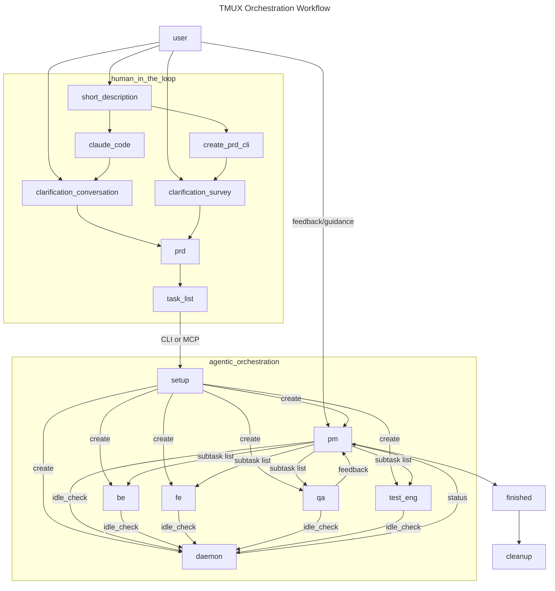

**Run AI agents 24/7 while you sleep** - The Tmux Orchestrator enables Claude agents to work autonomously, schedule their own check-ins, and coordinate across multiple projects without human intervention.

## 🚀 NEW: Version 2.0 - AI-Powered Team Management

### 🎯 Dynamic Team Composition (NEW!)
No more one-size-fits-all teams! The orchestrator now analyzes your project requirements and assembles the perfect team:
- **Automatic role selection** based on PRD analysis
- **Specialized agents** from 20+ templates (CLI devs, API designers, security engineers)
- **Team documentation** with interaction diagrams for recovery
- **Resource efficiency** - only deploy the agents you need

```bash
# Execute PRD with custom team composition
tmux-orc execute ./prd.md

# Or manually compose your team
tmux-orc team compose my-project --interactive
```

### 📋 Task Management System (NEW!)
Complete PRD-driven workflow with centralized task tracking:
- **PRD → Task List → Team → Execution** pipeline
- **Task distribution** to appropriate agents
- **Progress tracking** and status monitoring
- **Archive system** for completed projects

### 🔧 Advanced CLI (NEW!)
Professional CLI replacing all shell scripts:
```bash
tmux-orc setup            # One-time setup
tmux-orc execute prd.md   # Full PRD execution  
tmux-orc tasks create     # Task management
tmux-orc team compose     # Custom teams
tmux-orc agent status     # Monitor agents
```

### 🔌 MCP Server & VS Code Integration
- **REST API** via Model Context Protocol  
- **VS Code tasks** for quick agent access
- **Claude Code slash commands** for orchestration
- **Monitoring dashboards** in your editor  

## 🤖 Key Capabilities & Autonomous Features

- **Self-trigger** - Agents schedule their own check-ins and continue work autonomously
- **Coordinate** - Project managers assign tasks to engineers across multiple codebases  
- **Persist** - Work continues even when you close your laptop
- **Scale** - Run multiple teams working on different projects simultaneously

## 🏗️ Architecture

The Tmux Orchestrator uses a three-tier hierarchy to overcome context window limitations:

```
┌─────────────┐
│ Orchestrator│ ← You interact here
└──────┬──────┘
       │ Monitors & coordinates
       ▼
┌─────────────┐     ┌─────────────┐
│  Project    │     │  Project    │
│  Manager 1  │     │  Manager 2  │ ← Assign tasks, enforce specs
└──────┬──────┘     └──────┬──────┘
       │                   │
       ▼                   ▼
┌─────────────┐     ┌─────────────┐
│ Engineer 1  │     │ Engineer 2  │ ← Write code, fix bugs
└─────────────┘     └─────────────┘
```

### Why Separate Agents?
- **Limited context windows** - Each agent stays focused on its role
- **Specialized expertise** - PMs manage, engineers code
- **Parallel work** - Multiple engineers can work simultaneously
- **Better memory** - Smaller contexts mean better recall

### PRD-Driven Development Workflow



## 🐳 Quick Setup for Devcontainer Projects

### One-Command Integration
```bash
# Download and run the setup script
curl -O https://raw.githubusercontent.com/your-repo/tmux-orchestrator/main/setup-devcontainer.sh
chmod +x setup-devcontainer.sh
./setup-devcontainer.sh my-project-name
```

This automatically:
- Copies all orchestrator files
- Updates `devcontainer.json` 
- Creates project-specific scripts
- Sets up environment variables

### Manual Integration
```bash
# 1. Copy orchestrator to your project
cp -r Tmux-Orchestrator references/

# 2. Create installation script  
cp references/Tmux-Orchestrator/install-template.sh scripts/install-tmux-orchestrator.sh

# 3. Update devcontainer.json
{
  "postCreateCommand": "bash scripts/install-tmux-orchestrator.sh",
  "remoteEnv": {
    "TMUX_ORCHESTRATOR_HOME": "/workspaces/my-project/.tmux-orchestrator",
    "TMUX_ORCHESTRATOR_REGISTRY": "/workspaces/my-project/.tmux-orchestrator/registry"
  }
}

# 4. Rebuild devcontainer and deploy team
./scripts/deploy-my-project-team.sh tasks.md
```

## 🎯 VS Code Integration - New in v2.0!

### One-Click Agent Access
Open all your agents instantly through VS Code's Command Palette:

```
Ctrl+Shift+P → Tasks: Run Task → Select:

🎭 Open ALL Agent Terminals        ← Opens all 5 agents at once!
🎯 Open Orchestrator Agent         ← Main coordinator  
👔 Open Project Manager Agent      ← Planning & quality
🎨 Open Frontend Agent            ← UI/UX development
⚙️ Open Backend Agent             ← API & server logic
🧪 Open QA Agent                  ← Testing & verification
```

### PM Team Management
Perfect for when you notice agents are idle:

```
👔 PM Check-in with All Agents     ← Comprehensive status check
💬 PM Custom Check-in with All     ← Custom message for specific situations
```

### Agent Communication Commands
Agents now know how to message each other:

```bash
# PM can coordinate the team
scripts/send-claude-message.sh orchestrator:1 "Priority update: Focus on auth issues"
scripts/send-claude-message.sh corporate-coach-frontend:2 "UI fixes needed for login flow"

# Check team status using CLI  
tmux-orc agent status
tmux-orc list sessions
```

## 📸 Examples in Action

### Project Manager Coordination

*The orchestrator creating and briefing a new project manager agent*

### Status Reports & Monitoring

*Real-time status updates from multiple agents working in parallel*

### Tmux Communication

*How agents communicate across tmux windows and sessions*

### Project Completion

*Successful project completion with all tasks verified and committed*

## 🎯 Quick Start (Any Project Type)

### Option 1: PRD-Driven Execution (Recommended)
```bash
# Create PRD, then execute with dynamic team
tmux-orc execute ./prd.md

# Or create project structure first
tmux-orc tasks create my-project
# Edit .tmux_orchestrator/projects/my-project/prd.md
tmux-orc execute my-project
```

### Option 2: Manual Team Composition
```bash
# 1. Create and compose team
tmux-orc team compose my-project --interactive

# 2. Deploy the custom team
tmux-orc team deploy my-project --custom

# 3. Distribute tasks
tmux-orc tasks distribute my-project
```

### Option 3: Traditional Orchestrator
```bash
# Start orchestrator and let it handle everything
tmux-orc orchestrator start
# Then: "Deploy a team for the authentication project using project_spec.md"
```

## ✨ Enhanced Features

### 🔄 Advanced PM Suite
- **Smart Scheduling** - PM agents schedule their own follow-ups
- **Idle Detection** - Automatically detects stuck agents
- **Team Coordination** - Cross-team communication patterns
- **Quality Gates** - Automated quality checks

```bash
# PM management commands
tmux-orc pm check-in my-project
tmux-orc recovery check --auto-restart
tmux-orc team coordinate my-project
```

### 👥 Auto-Detecting Team Deployment
The orchestrator analyzes your task file and automatically deploys appropriate agents:

- **Frontend indicators**: react, vue, ui, component, html, css, javascript
- **Backend indicators**: api, service, endpoint, python, node, fastapi  
- **Database indicators**: database, sql, postgres, migration, schema
- **Always includes**: Orchestrator, PM, QA

### 💾 Enhanced Git Integration
- **Smart commits** every 30 minutes with meaningful messages
- **Feature branch** workflows
- **Quality gates** before merging
- **Automated tagging** of stable versions

### 📊 Real-Time Monitoring
```bash
# Monitor agent status
tmux-orc agent status

# Check team health
tmux-orc team status my-project

# View task progress  
tmux-orc tasks status my-project
```

## 📚 Comprehensive Documentation

### Getting Started
- **[Installation Guide](docs/setup/installation.md)** - Complete setup instructions
- **[Quick Start](docs/setup/quickstart.md)** - Get running in 5 minutes  
- **[CLI Quick Start](docs/setup/cli-quickstart.md)** - Using the tmux-orc command

### Core Concepts
- **[CLAUDE.md](CLAUDE.md)** - Agent behavior instructions and best practices
- **[Architecture](docs/development/architecture.md)** - System design and components
- **[Task Management](docs/workflows/task-management.md)** - PRD-driven development

### Features
- **[Dynamic Teams](docs/features/team-composition.md)** - Custom team composition
- **[DevContainer Integration](docs/features/devcontainer.md)** - Container setup
- **[Coordination](docs/features/coordination.md)** - Agent communication patterns

## 🛠️ Project Templates

### Web Application Stack
- Orchestrator + PM + Frontend + Backend + QA
- Auto-detects React, Vue, Angular frontends
- Supports Node.js, Python, Java backends

### API-Only Project  
- Orchestrator + PM + Backend + Database + QA
- Focus on API development and testing
- Database migration support

### Data Pipeline
- Orchestrator + PM + Data Engineer + Backend + QA  
- ETL/ELT workflow support
- Data validation and quality checks

## 📋 Best Practices

### Writing Effective Task Files
```markdown
PROJECT: E-commerce Checkout
GOAL: Implement multi-step checkout process

CONSTRAINTS:
- Use existing cart state management
- Follow current design system
- Maximum 3 API endpoints
- Commit after each step completion

DELIVERABLES:
1. Shipping address form with validation
2. Payment method selection (Stripe integration)
3. Order review and confirmation page
4. Success/failure handling

SUCCESS CRITERIA:
- All forms validate properly
- Payment processes without errors  
- Order data persists to database
- Emails send on completion
```

### Git Safety Rules
1. **Feature branches** for all work
2. **Commits every 30 minutes** with descriptive messages  
3. **Quality gates** before merging
4. **Stable tags** for working versions

## 🚨 Common Pitfalls & Solutions

| Pitfall | Consequence | Solution |
|---------|-------------|----------|
| Vague task descriptions | Agent drift, wasted compute | Write clear, specific task files |
| No git commits | Lost work, frustrated devs | Enforce 30-minute commit rule |
| Too many agents | Context overload, confusion | Use auto-detection or templates |
| Missing specifications | Unpredictable results | Always start with written specs |
| No monitoring | Agents stop working | Use provided monitoring tools |

## 🔧 Advanced Usage

### Multi-Project Orchestration
```bash
# Deploy multiple project teams
./bin/generic-team-deploy.sh frontend-tasks.md frontend-app
./bin/generic-team-deploy.sh backend-tasks.md api-service  
./bin/generic-team-deploy.sh data-tasks.md analytics-pipeline
```

### Custom Agent Briefings
```bash
# Customize the deployment script briefings
# Edit bin/generic-team-deploy.sh to add project-specific instructions
```

### Integration Hooks
```bash
# Add custom quality gates
echo "npm run lint && npm run test" > .tmux-orchestrator/qa/quality-gates.sh

# Add Slack notifications
echo "curl -X POST $SLACK_WEBHOOK ..." > .tmux-orchestrator/integrations/slack.sh
```

## 📄 Core Components

### CLI Commands
- **`tmux-orc`** - Main orchestrator CLI with all functionality
- **`tmux-orc execute`** - Execute PRDs with dynamic teams
- **`tmux-orc tasks`** - Complete task management system
- **`tmux-orc team`** - Team composition and deployment

### Essential Scripts (in scripts/)
- **`send-claude-message.sh`** - Direct agent communication
- **`schedule_with_note.sh`** - Self-scheduling functionality
- **`idle-monitor-daemon.sh`** - Idle detection daemon

### Configuration
- **`.tmux_orchestrator/`** - Task management directory
- **`CLAUDE.md`** - Agent behavior guidelines
- **`agent-templates/`** - 20+ specialized agent types

## 🤝 Contributing & Evolution

The orchestrator evolves through community use and feedback:

1. **Test in your projects** and report what works
2. **Submit improvements** for team deployment patterns  
3. **Share novel use cases** and coordination strategies
4. **Contribute project templates** for common stacks
5. **Enhance monitoring** and quality gate systems

## 📄 License

MIT License - Use freely across all your projects.

---

*"The future of development is autonomous teams working while you sleep"*