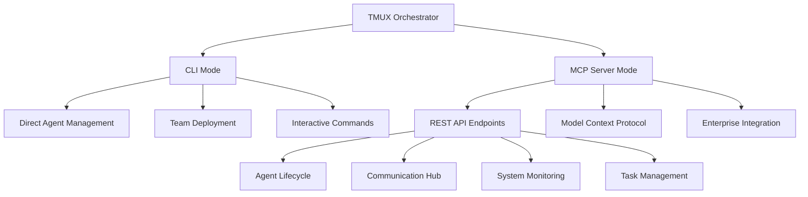

# TMUX Orchestrator v2.0
**Enterprise AI Agent Coordination Platform** - Run AI agents 24/7 with production-grade monitoring, team coordination, and Model Context Protocol (MCP) server integration.

## 🚀 NEW: Enterprise MCP Server + Enhanced Agent Communication

✅ **Production MCP Server** - Full REST API with 27 endpoints and 140+ validated models  
✅ **Enterprise Architecture** - SOLID principles, comprehensive error handling, OpenAPI docs  
✅ **Advanced Monitoring** - Real-time health checks, performance metrics, system status  
✅ **Team Coordination** - Automated deployment, standup coordination, recovery operations  
✅ **VS Code Integration** - Complete orchestrator control through Command Palette  
✅ **Agent Communication** - Sophisticated messaging, broadcasting, conversation history  

## 🏗️ Architecture Overview

### Dual-Mode Operation
The TMUX Orchestrator operates in two complementary modes:



### Agent Hierarchy
```
┌─────────────┐
│ Orchestrator│ ← You interact here (CLI/API)
└──────┬──────┘
       │ Monitors & coordinates via MCP Server
       ▼
┌─────────────┐     ┌─────────────┐
│  Project    │     │  Project    │
│  Manager 1  │     │  Manager 2  │ ← Assign tasks, enforce specs
└──────┬──────┘     └──────┬──────┘
       │                   │
       ▼                   ▼
┌─────────────┐     ┌─────────────┐
│ Engineer 1  │     │ Engineer 2  │ ← Write code, fix bugs
└─────────────┘     └─────────────┘
```

## 📦 Installation

### Prerequisites
- Python 3.9+ 
- Poetry for dependency management
- tmux 3.0+
- Claude CLI (for agent interaction)

### Quick Installation with Poetry

```bash
# Clone the repository
git clone https://github.com/your-org/tmux-orchestrator.git
cd tmux-orchestrator

# Install with Poetry (recommended)
poetry install

# Activate the environment
poetry shell

# Verify installation
tmux-orc --version
```

### Alternative: Development Installation

```bash
# Install in development mode
poetry install --with dev,test

# Run tests to verify setup
poetry run pytest

# Start the MCP server
poetry run tmux-orc server start
```

### Docker Installation (Enterprise)

```bash
# Pull the official image
docker pull tmux-orchestrator/server:latest

# Run with default configuration
docker run -p 8000:8000 tmux-orchestrator/server:latest

# Or use Docker Compose
docker-compose up -d
```

## 🚀 Quick Start Guide

### 1. CLI Mode - Interactive Management
```bash
# Deploy a team for your project
poetry run tmux-orc team deploy frontend 3 --project-name my-app

# Monitor team status
poetry run tmux-orc team status my-app

# Send message to team
poetry run tmux-orc team broadcast my-app "Sprint planning in 30 minutes"

# Check system status
poetry run tmux-orc status
```

### 2. MCP Server Mode - API Integration
```bash
# Start the MCP server
poetry run tmux-orc server start --host 0.0.0.0 --port 8000

# Access interactive documentation
open http://localhost:8000/docs
```

## 🔧 MCP Server API Usage

### Authentication & Base URL
```bash
# Default server configuration
BASE_URL="http://localhost:8000"
CONTENT_TYPE="application/json"

# All endpoints support JSON request/response
# No authentication required in development mode
```

### Agent Management Examples

#### Spawn a New Agent
```bash
curl -X POST "$BASE_URL/agents/spawn" \
  -H "Content-Type: application/json" \
  -d '{
    "session_name": "my-project", 
    "agent_type": "developer",
    "project_path": "/workspace/my-project",
    "briefing_message": "You are a senior React developer working on authentication components"
  }'
```

```json
{
  "success": true,
  "session": "my-project", 
  "window": "Claude-developer",
  "target": "my-project:Claude-developer",
  "agent_type": "developer",
  "created_at": "2025-01-08T15:30:00Z"
}
```

#### Get Agent Status
```bash
curl -X GET "$BASE_URL/agents/status?target=my-project:Claude-developer&include_activity=true"
```

```json
{
  "target": "my-project:Claude-developer",
  "status": "active",
  "responsive": true,
  "last_activity": "2025-01-08T15:35:00Z",
  "uptime_minutes": 45,
  "activity_summary": ["Working on login component", "Running tests"],
  "health_score": 95
}
```

#### List All Agents
```bash
curl -X GET "$BASE_URL/agents/list"
```

### Communication Examples

#### Send Message to Agent
```bash
curl -X POST "$BASE_URL/messages/send" \
  -H "Content-Type: application/json" \
  -d '{
    "target": "my-project:Claude-developer",
    "message": "Please focus on the authentication system now",
    "urgent": true
  }'
```

#### Broadcast to Multiple Sessions
```bash
curl -X POST "$BASE_URL/messages/broadcast" \
  -H "Content-Type: application/json" \
  -d '{
    "sessions": ["frontend-team", "backend-team"],
    "message": "Sprint planning meeting in 30 minutes",
    "agent_types_only": ["developer", "pm"],
    "urgent": true
  }'
```

### Team Coordination Examples

#### Deploy Complete Team
```bash
curl -X POST "$BASE_URL/coordination/deploy-team" \
  -H "Content-Type: application/json" \
  -d '{
    "project_name": "ecommerce-app",
    "project_path": "/workspace/ecommerce-app", 
    "team_members": [
      {
        "role": "pm",
        "briefing": "Lead the frontend development team",
        "skills": ["Project Management", "Agile"]
      },
      {
        "role": "developer",
        "briefing": "Focus on React components and state management", 
        "skills": ["React", "Redux", "TypeScript"]
      }
    ],
    "coordination_strategy": "hub_and_spoke"
  }'
```

#### Conduct Team Standup
```bash
curl -X POST "$BASE_URL/coordination/standup" \
  -H "Content-Type: application/json" \
  -d '{
    "session_names": ["frontend-team", "backend-team"],
    "include_idle_agents": true,
    "timeout_seconds": 30
  }'
```

### Monitoring Examples

#### System Health Check
```bash
curl -X GET "$BASE_URL/monitor/health"
```

```json
{
  "status": "healthy",
  "tmux_responsive": true,
  "active_sessions": 3,
  "responsive_agents": 7,
  "timestamp": "2025-01-08T15:30:00Z",
  "checks_performed": ["tmux_connectivity", "agent_responsiveness"],
  "response_time_ms": 145
}
```

#### Get System Status
```bash
curl -X GET "$BASE_URL/monitor/status" \
  -H "Content-Type: application/json" \
  -d '{
    "include_metrics": true,
    "include_agent_details": true
  }'
```

### Task Management Examples

#### Create Task
```bash
curl -X POST "$BASE_URL/tasks/create" \
  -H "Content-Type: application/json" \
  -d '{
    "title": "Implement user authentication",
    "description": "Create JWT-based auth system with secure token handling",
    "priority": "high",
    "assigned_to": "my-project:Claude-developer",
    "completion_criteria": [
      "Login form completed",
      "Token storage implemented",
      "Session management working"
    ],
    "estimated_hours": 4.5,
    "tags": ["authentication", "security"]
  }'
```

#### List Tasks
```bash
curl -X GET "$BASE_URL/tasks/list?status=in_progress&priority=high&limit=20"
```

## 🔍 API Documentation

### Interactive Documentation
The MCP Server provides comprehensive interactive documentation:

```bash
# Start the server
poetry run tmux-orc server start

# Access Swagger UI
open http://localhost:8000/docs

# Access ReDoc
open http://localhost:8000/redoc

# Get OpenAPI schema
curl http://localhost:8000/openapi.json
```

### API Categories

| Category | Endpoints | Description |
|----------|-----------|-------------|
| **Agent Management** | `/agents/*` | Spawn, restart, kill, status monitoring |
| **Communication** | `/messages/*` | Inter-agent messaging and broadcasting |
| **Monitoring** | `/monitor/*` | Health checks and system monitoring |
| **Coordination** | `/coordination/*` | Team deployment and coordination |
| **Task Management** | `/tasks/*` | Task creation and tracking |

### Response Formats
All API responses follow consistent patterns:

```json
{
  "success": true,
  "data": { /* response data */ },
  "error_message": null,
  "timestamp": "2025-01-08T15:30:00Z"
}
```

## 🐳 Deployment Options

### Development
```bash
# Local development server
poetry run tmux-orc server start --reload

# With specific configuration
poetry run tmux-orc server start --host 0.0.0.0 --port 8080 --workers 4
```

### Production (Docker)
```yaml
# docker-compose.yml
version: '3.8'
services:
  tmux-orchestrator:
    image: tmux-orchestrator/server:latest
    ports:
      - "8000:8000"
    environment:
      - TMUX_ORC_HOST=0.0.0.0
      - TMUX_ORC_PORT=8000
      - TMUX_ORC_WORKERS=4
    volumes:
      - ./config:/app/config
    restart: unless-stopped
```

### Kubernetes
```yaml
apiVersion: apps/v1
kind: Deployment
metadata:
  name: tmux-orchestrator
spec:
  replicas: 3
  selector:
    matchLabels:
      app: tmux-orchestrator
  template:
    metadata:
      labels:
        app: tmux-orchestrator
    spec:
      containers:
      - name: tmux-orchestrator
        image: tmux-orchestrator/server:latest
        ports:
        - containerPort: 8000
        env:
        - name: TMUX_ORC_HOST
          value: "0.0.0.0"
```

## 🧪 Testing

### Unit Tests
```bash
# Run all tests
poetry run pytest

# Run with coverage
poetry run pytest --cov=tmux_orchestrator

# Run specific test categories
poetry run pytest tests/test_server/
poetry run pytest tests/test_cli/
```

### Integration Tests
```bash
# Test MCP server endpoints
poetry run pytest tests/integration/test_mcp_server.py

# Test agent coordination
poetry run pytest tests/integration/test_agent_coordination.py
```

### Load Testing
```bash
# Install load testing tools
poetry install --with test

# Run load tests against MCP server
poetry run locust -f tests/load/test_mcp_endpoints.py
```

## 🎯 VS Code Integration

### Command Palette Tasks
Access all orchestrator functions through VS Code:

```
Ctrl+Shift+P → Tasks: Run Task → Select:

🎭 Open ALL Agent Terminals        ← Opens all agents at once
🎯 Open Orchestrator Agent         ← Main coordinator  
👔 Open Project Manager Agent      ← Planning & quality
🎨 Open Frontend Agent            ← UI/UX development
⚙️ Open Backend Agent             ← API & server logic
🧪 Open QA Agent                  ← Testing & verification

📊 Start MCP Server              ← Launch API server
📈 View API Documentation        ← Open /docs endpoint
🔍 Monitor System Status         ← Check health metrics
```

### Settings Configuration
```json
{
  "tmux-orchestrator.server.host": "localhost",
  "tmux-orchestrator.server.port": 8000,
  "tmux-orchestrator.autostart": true,
  "tmux-orchestrator.monitoring.enabled": true
}
```

## 📊 Monitoring & Observability

### Built-in Metrics
```bash
# System metrics endpoint
curl http://localhost:8000/monitor/metrics

# Health status with diagnostics
curl http://localhost:8000/monitor/health?include_diagnostics=true

# Agent performance metrics
curl http://localhost:8000/monitor/agents/performance
```

### Prometheus Integration
```yaml
# prometheus.yml
scrape_configs:
  - job_name: 'tmux-orchestrator'
    static_configs:
      - targets: ['localhost:8000']
    metrics_path: '/metrics'
    scrape_interval: 15s
```

### Grafana Dashboards
Pre-built dashboards available for:
- Agent performance and health
- System resource utilization  
- API endpoint metrics
- Team coordination effectiveness

## 🔧 Configuration

### Environment Variables
```bash
# Server configuration
export TMUX_ORC_HOST=0.0.0.0
export TMUX_ORC_PORT=8000
export TMUX_ORC_WORKERS=4

# Logging
export TMUX_ORC_LOG_LEVEL=INFO
export TMUX_ORC_LOG_FORMAT=json

# Monitoring
export TMUX_ORC_METRICS_ENABLED=true
export TMUX_ORC_HEALTH_CHECK_INTERVAL=30
```

### Configuration File
```toml
# config/orchestrator.toml
[server]
host = "0.0.0.0"
port = 8000
workers = 4

[monitoring]
enabled = true
health_check_interval = 30
metrics_retention_hours = 24

[agents]
default_timeout = 30
max_concurrent_spawns = 10
recovery_enabled = true
```

## 🚨 Troubleshooting

### Common Issues

#### MCP Server Won't Start
```bash
# Check port availability
lsof -i :8000

# Verify Poetry environment
poetry env info

# Check logs
poetry run tmux-orc server start --log-level DEBUG
```

#### Agents Not Responding
```bash
# Check agent health
poetry run tmux-orc agent status session:window

# View agent activity
poetry run tmux-orc monitor agents idle

# Restart unresponsive agents
poetry run tmux-orc agent restart session:window
```

#### API Errors
```bash
# Validate request format
curl -X POST http://localhost:8000/agents/spawn \
  -H "Content-Type: application/json" \
  -d '{"invalid": "data"}' -v

# Check server logs
docker logs tmux-orchestrator-container
```

### Debug Mode
```bash
# Enable debug logging
poetry run tmux-orc server start --debug

# Verbose CLI output
poetry run tmux-orc --verbose team status my-project

# Enable development mode
export TMUX_ORC_ENV=development
```

## 📚 Advanced Usage

### Custom Agent Types
```bash
# Define custom agent in config
[agents.custom_types.data_engineer]
briefing = "Specialized in ETL pipelines and data validation"
required_tools = ["pandas", "numpy", "sqlalchemy"]
default_timeout = 60
```

### Webhooks & Integrations
```bash
# Slack notifications
export SLACK_WEBHOOK_URL=https://hooks.slack.com/...

# Email alerts
export SMTP_HOST=smtp.gmail.com
export SMTP_USER=alerts@company.com
```

### Custom Quality Gates
```python
# custom_quality_gate.py
from tmux_orchestrator.integrations.quality import QualityGate

class CustomQualityGate(QualityGate):
    def validate(self, code_changes):
        # Custom validation logic
        return self.run_custom_checks(code_changes)
```

## 🤝 Contributing

### Development Setup
```bash
# Clone and install
git clone https://github.com/your-org/tmux-orchestrator.git
cd tmux-orchestrator
poetry install --with dev,test

# Install pre-commit hooks
poetry run pre-commit install

# Run tests before contributing
poetry run pytest
poetry run mypy .
poetry run ruff check .
```

### Contribution Guidelines
1. **Follow Code Standards** - Use ruff for linting, mypy for type checking
2. **Write Tests** - Maintain 90%+ test coverage for new features
3. **Update Documentation** - Include API examples and usage guides
4. **Type Safety** - Full type hints required for all new code
5. **Performance** - Profile API endpoints and optimize bottlenecks

## 📄 License

MIT License - Use freely across all your projects.

---

## 📖 Additional Documentation

- **[API Reference](docs/api-reference.md)** - Complete endpoint documentation
- **[Agent Development Guide](docs/agent-development.md)** - Creating custom agents
- **[Deployment Guide](docs/deployment.md)** - Production deployment patterns
- **[Integration Examples](docs/integrations/)** - Third-party integrations
- **[Troubleshooting](docs/troubleshooting.md)** - Common issues and solutions

*"The future of development is autonomous teams working through intelligent coordination"*