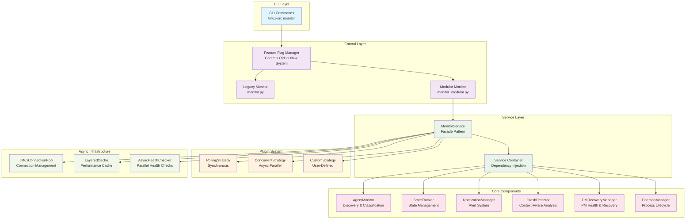

# ADR-001: Monitor.py SOLID Refactor Architecture

## Status
Accepted

## Context
The original `monitor.py` file had grown to 2,227 lines, becoming a "god class" that violated SOLID principles and was difficult to maintain, test, and extend. The monitoring system is critical infrastructure that needs to be reliable, performant, and extensible.

### Problems with the Original Design:
1. **Single Responsibility Violation**: One class handled agent discovery, health checking, crash detection, PM recovery, notifications, state management, and daemon lifecycle
2. **Open/Closed Violation**: Adding new monitoring strategies required modifying the core monitor class
3. **Interface Segregation Violation**: Components were tightly coupled with no clear interfaces
4. **Dependency Inversion Violation**: Concrete implementations were used directly instead of abstractions
5. **Testability Issues**: Monolithic design made unit testing individual features nearly impossible
6. **Performance Limitations**: Synchronous design limited scalability for monitoring many agents

## Decision

We will refactor the monitoring system into a modular, component-based architecture following SOLID principles with these key design elements:

### 1. Component-Based Architecture
- **AgentMonitor**: Agent discovery and window detection
- **CrashDetector**: Context-aware crash detection logic
- **NotificationManager**: Notification queuing and delivery
- **StateTracker**: Agent and session state management
- **PMRecoveryManager**: PM health monitoring and recovery
- **DaemonManager**: Process lifecycle management
- **MetricsCollector**: Performance and operational metrics

### 2. Service-Oriented Design
- **MonitorService**: Facade that orchestrates components
- **ServiceContainer**: Dependency injection container
- **Clean Interfaces**: Each component implements a well-defined interface

### 3. Plugin Architecture
- **MonitoringStrategy Interface**: Pluggable monitoring behaviors
- **PluginLoader**: Dynamic strategy loading
- **Built-in Strategies**: Polling (sync) and Concurrent (async)

### 4. Async-First Implementation
- **AsyncMonitorService**: Extends base with async capabilities
- **TMuxConnectionPool**: Connection pooling for concurrent operations
- **LayeredCache**: Multi-level caching for performance
- **Async Health Checking**: Parallel agent health checks

### 5. Safe Rollout Strategy
- **Feature Flags**: Environment and file-based configuration
- **Rollout Stages**: DISABLED → CANARY (5%) → BETA (50%) → PRODUCTION (100%)
- **Parallel Comparison**: Run both systems side-by-side during transition
- **Automatic Progression**: Health-based stage advancement

## Architecture Diagram

## Consequences

### Positive
1. **Modularity**: Each component has a single, well-defined responsibility
2. **Testability**: Components can be unit tested in isolation
3. **Extensibility**: New strategies can be added without modifying core code
4. **Performance**: Async operations enable monitoring 50+ agents efficiently
5. **Maintainability**: Smaller, focused files are easier to understand and modify
6. **Type Safety**: Interfaces provide compile-time type checking
7. **Safe Rollout**: Feature flags enable zero-downtime migration

### Negative
1. **Complexity**: More files and abstractions to understand
2. **Learning Curve**: Developers need to understand DI and plugin patterns
3. **Migration Effort**: Existing deployments need careful migration
4. **Overhead**: Service container adds minimal runtime overhead

### Tradeoffs
1. **Flexibility vs Simplicity**: More flexible but requires understanding the architecture
2. **Performance vs Compatibility**: Async provides better performance but requires Python 3.7+
3. **Safety vs Speed**: Gradual rollout is safer but takes longer to complete

## Implementation Guidelines

### For Component Development:
1. Always implement the interface first
2. Keep components under 300 lines
3. Use dependency injection for all dependencies
4. Write unit tests alongside implementation

### For Async Components:
1. Use `async def` for I/O-bound operations
2. Leverage the TMux connection pool
3. Implement proper error handling and timeouts
4. Use the cache layer for repeated queries

### For Plugin Development:
1. Extend `BaseMonitoringStrategy`
2. Declare required components explicitly
3. Handle missing components gracefully
4. Document configuration options

## Monitoring and Validation

### Success Metrics:
- **Performance**: 50+ agents monitored without degradation
- **Reliability**: <0.1% error rate in production
- **Test Coverage**: >90% unit test coverage per component
- **Response Time**: <1s monitoring cycle for 20 agents

### Rollout Validation:
- **Canary**: Monitor error rates and performance for 24 hours
- **Beta**: Validate with larger agent counts for 72 hours
- **Production**: Full deployment after successful beta

## Related Decisions
- Use of pydantic for configuration validation
- Choice of asyncio over threading for concurrency
- Decision to maintain backward compatibility for 2-3 releases

## References
- SOLID Principles: https://en.wikipedia.org/wiki/SOLID
- Dependency Injection: https://martinfowler.com/articles/injection.html
- Plugin Architecture: https://en.wikipedia.org/wiki/Plug-in_(computing)
- Feature Toggles: https://martinfowler.com/articles/feature-toggles.html
