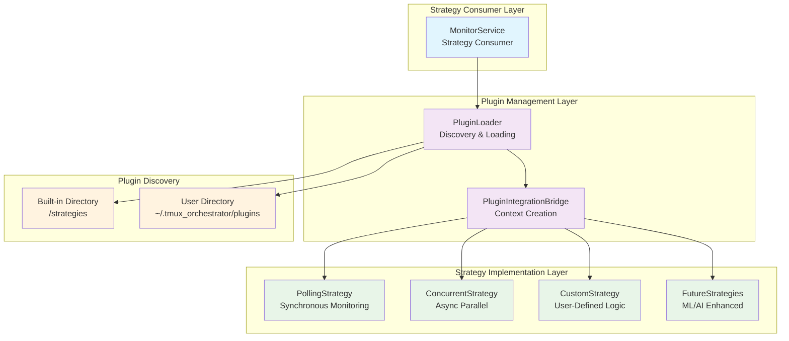

# ADR-003: Plugin-Based Monitoring Strategies

## Status
Accepted

## Context
Different monitoring scenarios require different strategies:
- Small teams need simple polling
- Large deployments need concurrent monitoring
- Some users may need custom monitoring logic

Hard-coding all strategies in the core would violate the Open/Closed Principle.

## Decision
Implement a plugin architecture for monitoring strategies:

### 1. Strategy Interface
```python
class MonitoringStrategyInterface(ABC):
    @abstractmethod
    async def execute(self, context: Dict[str, Any]) -> MonitorStatus:
        """Execute the monitoring strategy."""

    @abstractmethod
    def get_required_components(self) -> List[type]:
        """Declare required dependencies."""
```

### 2. Plugin Discovery
- Built-in strategies in `/strategies` directory
- User plugins in `~/.tmux_orchestrator/plugins`
- Dynamic loading with validation

### 3. Strategy Selection
- Configuration-based selection
- Runtime strategy switching
- Fallback to default strategy

## Architecture



## Consequences

### Positive
- New strategies without core changes
- User-defined monitoring logic
- A/B testing of strategies
- Strategy-specific optimizations

### Negative
- Plugin validation complexity
- Potential security concerns
- Version compatibility management

## Implementation Guidelines
1. Strategies must be stateless
2. All I/O through provided interfaces
3. Proper error handling required
4. Performance metrics collection
