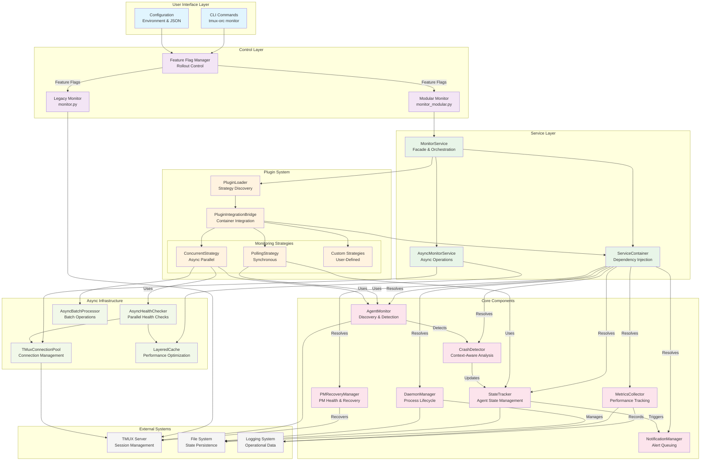

# Tmux Orchestrator Monitoring Architecture

## High-Level Architecture Diagram



## Component Responsibility Matrix

| Layer | Component | Primary Responsibility | Secondary Responsibilities |
|-------|-----------|----------------------|---------------------------|
| **User Interface** | CLI | Command parsing & execution | Configuration loading |
| | Config | System configuration | Environment variable handling |
| **Control** | Feature Flag Manager | Rollout stage management | Health-based progression |
| | Legacy Monitor | Backward compatibility | Fallback operations |
| | Modular Monitor | New architecture entry | Process lifecycle |
| **Service** | MonitorService | Component orchestration | Strategy coordination |
| | AsyncMonitorService | Async operation management | Performance optimization |
| | ServiceContainer | Dependency injection | Lifecycle management |
| **Plugin** | PluginLoader | Strategy discovery | Dynamic loading |
| | PluginIntegrationBridge | Container integration | Context creation |
| | Strategies | Monitoring execution | Component coordination |
| **Core** | AgentMonitor | Agent discovery | Window identification |
| | CrashDetector | Crash analysis | Context awareness |
| | StateTracker | State management | Persistence |
| | NotificationManager | Alert delivery | Queuing & batching |
| | PMRecoveryManager | PM health monitoring | Recovery coordination |
| | DaemonManager | Process management | Signal handling |
| | MetricsCollector | Performance tracking | Export formatting |
| **Async** | TMuxConnectionPool | Connection management | Resource optimization |
| | LayeredCache | Performance caching | Memory management |
| | AsyncHealthChecker | Parallel health checks | Timeout handling |
| | AsyncBatchProcessor | Batch operations | Efficiency optimization |

## Data Flow Patterns

### 1. Monitoring Cycle Flow
```
CLI Command → Feature Flags → Strategy Selection → Component Resolution →
Parallel Execution → Result Aggregation → Notification Processing →
Metrics Recording → State Persistence
```

### 2. Agent Discovery Flow
```
AgentMonitor.discover_agents() → TMUX.list_sessions() →
Window Analysis → Agent Classification → StateTracker.update() →
Cache.store() → Return AgentInfo[]
```

### 3. Crash Detection Flow
```
Strategy.execute() → CrashDetector.analyze() → Context Analysis →
Pattern Matching → StateTracker.mark_crashed() →
NotificationManager.queue() → PMRecoveryManager.trigger()
```

### 4. PM Recovery Flow
```
PMRecoveryManager.detect_crash() → Grace Period Check →
Recovery Decision → spawn_orc.run() → Team Notification →
StateTracker.update() → Metrics Recording
```

## Performance Characteristics

### Scalability Targets
- **Small Teams** (1-10 agents): <500ms cycle time
- **Medium Teams** (11-25 agents): <1s cycle time
- **Large Teams** (26-50 agents): <2s cycle time
- **Enterprise** (50+ agents): <5s cycle time

### Resource Usage
- **Memory**: Linear growth ~2MB per 10 agents
- **CPU**: Burst during monitoring cycles, idle between
- **Network**: Minimal - local TMUX communication only
- **Disk**: State files <1MB, logs rotated

### Fault Tolerance
- **Circuit Breakers**: Prevent cascade failures
- **Retry Logic**: Handle transient errors
- **Graceful Degradation**: Reduced functionality vs failure
- **State Recovery**: Resume from persistent state

## Security Considerations

### Attack Vectors
1. **Plugin Security**: Malicious strategy injection
2. **Command Injection**: TMUX command construction
3. **State Tampering**: Persistent state modification
4. **Resource Exhaustion**: Connection pool abuse

### Mitigation Strategies
1. **Plugin Validation**: Signature verification, sandboxing
2. **Input Sanitization**: Command parameter validation
3. **File Permissions**: Restricted state file access
4. **Resource Limits**: Connection timeouts, pool limits
