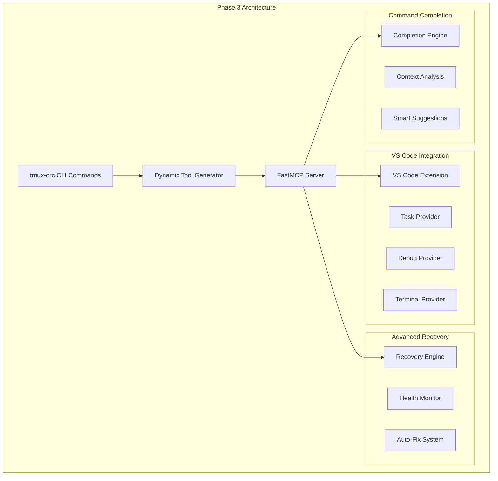

# MCP Phase 3 Design: Advanced Developer Tools

## Executive Summary

Phase 3 leverages the revolutionary dynamic CLI introspection architecture to provide advanced developer tooling including VS Code integration, intelligent recovery systems, and command completion. This phase focuses on enhancing developer experience and system resilience.

## Architecture Foundation

### Building on Dynamic CLI Introspection
Phase 3 continues the game-changing approach where **CLI commands automatically become MCP tools**. This eliminates manual tool implementation and ensures perfect feature parity.



## Phase 3 Components

### 1. VS Code Integration Tools

#### 1.1 Development Environment Setup
**Purpose**: Seamless VS Code integration with tmux-orchestrator workflow

**Auto-Generated MCP Tools** (from CLI commands):
- `setup_vscode` ← `tmux-orc setup vscode`
- `vscode_configure_tasks` ← `tmux-orc setup vscode --tasks`
- `vscode_configure_debug` ← `tmux-orc setup vscode --debug`
- `vscode_sync_agents` ← `tmux-orc setup vscode --sync-agents`

#### 1.2 VS Code Extension Architecture
```typescript
// vscode-tmux-orchestrator/src/extension.ts
export class TmuxOrchestratorExtension {
    private mcpClient: MCPClient;

    async activate(context: vscode.ExtensionContext) {
        // Connect to MCP server
        this.mcpClient = new MCPClient("tmux-orchestrator");

        // Register providers
        this.registerTaskProvider();
        this.registerDebugProvider();
        this.registerTerminalProvider();
        this.registerAgentCommands();
    }

    private registerTaskProvider() {
        // Automatically discover tmux-orc tasks via MCP
        vscode.tasks.registerTaskProvider('tmux-orc', {
            provideTasks: async () => {
                const tools = await this.mcpClient.listTools();
                return tools.map(tool => this.createVSCodeTask(tool));
            }
        });
    }
}
```

#### 1.3 Task Integration
**VS Code Tasks from MCP Tools**:
```json
{
    "version": "2.0.0",
    "tasks": [
        {
            "label": "Deploy Frontend Team",
            "type": "tmux-orc",
            "command": "deploy_team",
            "args": {
                "team_name": "${workspaceFolderBasename}",
                "team_type": "frontend",
                "size": 3
            },
            "group": "build",
            "presentation": {
                "echo": true,
                "reveal": "always",
                "panel": "new"
            }
        },
        {
            "label": "Check Agent Status",
            "type": "tmux-orc",
            "command": "get_agent_status",
            "args": {},
            "group": "test"
        }
    ]
}
```

#### 1.4 Debug Configuration
**Auto-Generated Debug Configs**:
```json
{
    "version": "0.2.0",
    "configurations": [
        {
            "name": "Debug Agent Session",
            "type": "tmux-orc-debug",
            "request": "attach",
            "sessionPattern": "${workspaceFolderBasename}:*",
            "preLaunchTask": "Deploy Frontend Team"
        },
        {
            "name": "Monitor Agent Health",
            "type": "tmux-orc-monitor",
            "request": "launch",
            "monitoringInterval": 30,
            "autoRecover": true
        }
    ]
}
```

### 2. Advanced Recovery Tools

#### 2.1 Intelligent Recovery Engine
**Purpose**: Advanced agent recovery with context awareness and predictive healing

**Auto-Generated MCP Tools**:
- `advanced_recovery_start` ← `tmux-orc recovery start --advanced`
- `recovery_analyze_patterns` ← `tmux-orc recovery analyze`
- `recovery_predict_failures` ← `tmux-orc recovery predict`
- `recovery_auto_heal` ← `tmux-orc recovery heal --auto`

#### 2.2 Recovery Architecture
```python
# tmux_orchestrator/core/recovery/advanced_recovery.py
class AdvancedRecoveryEngine:
    """Intelligent recovery with ML-based failure prediction."""

    def __init__(self,
                 pattern_analyzer: FailurePatternAnalyzer,
                 predictor: FailurePredictorInterface,
                 healer: AutoHealerInterface):
        self.pattern_analyzer = pattern_analyzer
        self.predictor = predictor
        self.healer = healer
        self.recovery_history = RecoveryHistoryTracker()

    async def analyze_failure_patterns(self) -> FailurePatternAnalysis:
        """Analyze historical failure patterns for prediction."""
        # Analyze past 30 days of recovery events
        history = await self.recovery_history.get_recent_failures(days=30)

        patterns = self.pattern_analyzer.identify_patterns(history)

        return FailurePatternAnalysis(
            common_failure_types=patterns.failure_types,
            time_based_patterns=patterns.temporal_patterns,
            agent_type_correlations=patterns.agent_correlations,
            environmental_triggers=patterns.environmental_factors,
            prediction_confidence=patterns.confidence_score
        )

    async def predict_upcoming_failures(self) -> List[FailurePrediction]:
        """Predict potential failures before they occur."""
        current_system_state = await self._get_system_state()
        patterns = await self.analyze_failure_patterns()

        predictions = self.predictor.predict_failures(
            current_state=current_system_state,
            historical_patterns=patterns,
            prediction_window_hours=24
        )

        return predictions

    async def auto_heal_system(self) -> HealingResult:
        """Automatically heal predicted or detected issues."""
        predictions = await self.predict_upcoming_failures()

        healing_actions = []
        for prediction in predictions:
            if prediction.confidence > 0.8:  # High confidence threshold
                action = await self.healer.create_healing_action(prediction)
                result = await self.healer.execute_healing(action)
                healing_actions.append(result)

        return HealingResult(
            predictions_addressed=len(predictions),
            healing_actions=healing_actions,
            system_health_improvement=await self._calculate_health_improvement()
        )
```

#### 2.3 Failure Pattern Analysis
```python
@dataclass
class FailurePatternAnalysis:
    """Analysis of failure patterns for predictive recovery."""
    common_failure_types: List[FailureType]
    time_based_patterns: Dict[str, float]  # Hour -> failure probability
    agent_type_correlations: Dict[str, float]  # Agent type -> failure rate
    environmental_triggers: List[EnvironmentalTrigger]
    prediction_confidence: float

    def get_risk_assessment(self, agent_type: str, current_hour: int) -> RiskAssessment:
        """Get risk assessment for specific agent at current time."""
        base_risk = self.agent_type_correlations.get(agent_type, 0.1)
        time_risk = self.time_based_patterns.get(str(current_hour), 0.1)

        combined_risk = min(base_risk + time_risk, 1.0)

        return RiskAssessment(
            risk_level=combined_risk,
            contributing_factors=[
                f"Agent type risk: {base_risk:.2%}",
                f"Time-based risk: {time_risk:.2%}"
            ],
            recommended_actions=self._get_recommended_actions(combined_risk)
        )
```

### 3. CLI Command Completion Tools

#### 3.1 Intelligent Completion Engine
**Purpose**: Context-aware command completion with smart suggestions

**Auto-Generated MCP Tools**:
- `completion_generate` ← `tmux-orc completion generate`
- `completion_analyze_context` ← `tmux-orc completion analyze`
- `completion_suggest_workflow` ← `tmux-orc completion suggest`
- `completion_learn_patterns` ← `tmux-orc completion learn`

#### 3.2 Completion Architecture
```python
# tmux_orchestrator/core/completion/completion_engine.py
class CompletionEngine:
    """Context-aware command completion with machine learning."""

    def __init__(self,
                 context_analyzer: ContextAnalyzerInterface,
                 pattern_learner: PatternLearnerInterface,
                 suggestion_engine: SuggestionEngineInterface):
        self.context_analyzer = context_analyzer
        self.pattern_learner = pattern_learner
        self.suggestion_engine = suggestion_engine
        self.command_history = CommandHistoryTracker()

    async def generate_completions(
        self,
        partial_command: str,
        current_context: SystemContext
    ) -> CompletionResult:
        """Generate intelligent command completions."""

        # Analyze current system context
        context_analysis = await self.context_analyzer.analyze_context(current_context)

        # Get user's command patterns
        user_patterns = await self.pattern_learner.get_user_patterns()

        # Generate base completions
        base_completions = self._get_base_completions(partial_command)

        # Enhance with context-aware suggestions
        enhanced_completions = await self.suggestion_engine.enhance_completions(
            base_completions=base_completions,
            context=context_analysis,
            user_patterns=user_patterns
        )

        return CompletionResult(
            completions=enhanced_completions,
            context_suggestions=context_analysis.suggested_workflows,
            learning_feedback=await self._generate_learning_feedback(enhanced_completions)
        )

    async def suggest_workflow_continuation(
        self,
        last_commands: List[str],
        current_system_state: SystemState
    ) -> WorkflowSuggestion:
        """Suggest next logical commands in workflow."""

        # Identify current workflow pattern
        workflow_pattern = await self.pattern_learner.identify_workflow(last_commands)

        # Analyze what's missing or could be improved
        workflow_analysis = await self.context_analyzer.analyze_workflow_completion(
            pattern=workflow_pattern,
            current_state=current_system_state
        )

        # Generate contextual suggestions
        suggestions = await self.suggestion_engine.suggest_next_steps(
            workflow_pattern=workflow_pattern,
            analysis=workflow_analysis,
            user_preferences=await self.pattern_learner.get_user_preferences()
        )

        return WorkflowSuggestion(
            next_commands=suggestions.commands,
            rationale=suggestions.reasoning,
            confidence=suggestions.confidence,
            alternative_workflows=suggestions.alternatives
        )
```

#### 3.3 Context Analysis
```python
@dataclass
class SystemContext:
    """Current system context for completion analysis."""
    active_sessions: List[SessionInfo]
    running_agents: List[AgentInfo]
    recent_commands: List[CommandInfo]
    project_structure: ProjectStructureInfo
    monitoring_status: MonitoringStatusInfo
    error_conditions: List[ErrorCondition]

class ContextAnalyzer:
    """Analyzes system context for intelligent suggestions."""

    async def analyze_context(self, context: SystemContext) -> ContextAnalysis:
        """Analyze current context and suggest relevant commands."""

        analysis = ContextAnalysis()

        # Check for common workflow patterns
        if not context.active_sessions:
            analysis.suggested_workflows.append(
                WorkflowSuggestion(
                    name="Initial Setup",
                    commands=["tmux-orc team deploy", "tmux-orc monitor start"],
                    reason="No active sessions detected"
                )
            )

        # Check for error conditions requiring attention
        if context.error_conditions:
            analysis.urgent_suggestions.append(
                UrgentSuggestion(
                    command="tmux-orc recovery start --auto",
                    reason=f"{len(context.error_conditions)} error conditions detected",
                    priority="high"
                )
            )

        # Check for optimization opportunities
        if len(context.running_agents) > 10:
            analysis.optimization_suggestions.append(
                OptimizationSuggestion(
                    command="tmux-orc monitor start --interval 15",
                    reason="Large number of agents may benefit from closer monitoring",
                    impact="performance"
                )
            )

        return analysis
```

## Dynamic CLI Integration

### Phase 3 CLI Commands (Auto-Generated Tools)

All Phase 3 functionality follows the dynamic CLI introspection pattern:

```bash
# VS Code Integration Commands
tmux-orc setup vscode [PROJECT_PATH]              → setup_vscode
tmux-orc setup vscode --tasks                     → vscode_configure_tasks
tmux-orc setup vscode --debug                     → vscode_configure_debug
tmux-orc setup vscode --sync-agents               → vscode_sync_agents

# Advanced Recovery Commands
tmux-orc recovery start --advanced                → advanced_recovery_start
tmux-orc recovery analyze                         → recovery_analyze_patterns
tmux-orc recovery predict                         → recovery_predict_failures
tmux-orc recovery heal --auto                     → recovery_auto_heal
tmux-orc recovery patterns --export               → export_recovery_patterns

# Completion Commands
tmux-orc completion generate                       → completion_generate
tmux-orc completion analyze                       → completion_analyze_context
tmux-orc completion suggest                       → completion_suggest_workflow
tmux-orc completion learn                         → completion_learn_patterns
tmux-orc completion export-config                 → export_completion_config
```

### Auto-Generation Benefits

1. **Zero Manual Tool Implementation**: All tools auto-generated from CLI
2. **Perfect CLI Parity**: Every CLI feature available via MCP
3. **Consistent Interface**: All tools follow same patterns
4. **Future-Proof**: New CLI commands automatically become MCP tools
5. **Reduced Testing Burden**: Test CLI once, MCP tools work automatically

## Service Container Integration

### Phase 3 Service Registration
```python
# tmux_orchestrator/core/services/phase3_services.py
def register_phase3_services(container: ServiceContainer):
    """Register Phase 3 services following SOLID principles."""

    # VS Code Integration Services
    container.register(
        VSCodeIntegrationServiceInterface,
        lambda: VSCodeIntegrationService(
            container.resolve(TMUXManager),
            container.resolve(ProjectServiceInterface),
            container.resolve(Config)
        )
    )

    # Advanced Recovery Services
    container.register(
        AdvancedRecoveryEngineInterface,
        lambda: AdvancedRecoveryEngine(
            container.resolve(FailurePatternAnalyzer),
            container.resolve(FailurePredictorInterface),
            container.resolve(AutoHealerInterface)
        )
    )

    # Completion Services
    container.register(
        CompletionEngineInterface,
        lambda: CompletionEngine(
            container.resolve(ContextAnalyzerInterface),
            container.resolve(PatternLearnerInterface),
            container.resolve(SuggestionEngineInterface)
        )
    )
```

## Testing Strategy

### Phase 3 Testing Approach
Since tools are auto-generated from CLI commands, testing focuses on:

1. **CLI Command Testing**: Comprehensive CLI functionality tests
2. **MCP Integration Testing**: Tool generation and execution
3. **VS Code Extension Testing**: Extension functionality
4. **Recovery System Testing**: Failure simulation and recovery
5. **Completion Engine Testing**: Context analysis and suggestions

### Test Structure
```python
# tests/phase3/test_vscode_integration.py
class TestVSCodeIntegration:
    """Test VS Code integration via auto-generated MCP tools."""

    async def test_setup_vscode_tool_generation(self):
        """Test that setup vscode CLI command generates proper MCP tool."""
        generator = ClickToMCPGenerator(mcp_server)
        tools = generator.generate_all_tools()

        assert "setup_vscode" in tools
        assert tools["setup_vscode"]["input_schema"]["properties"]["project_path"]

    async def test_vscode_task_configuration(self):
        """Test VS Code task configuration via MCP tool."""
        result = await mcp_server.call_tool("vscode_configure_tasks", {
            "project_path": "/test/project"
        })

        assert result["success"] is True
        assert "tasks.json" in result["configured_files"]

# tests/phase3/test_advanced_recovery.py
class TestAdvancedRecovery:
    """Test advanced recovery system."""

    async def test_failure_pattern_analysis(self):
        """Test failure pattern analysis tool."""
        result = await mcp_server.call_tool("recovery_analyze_patterns", {})

        assert result["success"] is True
        assert "failure_types" in result["analysis"]
        assert "prediction_confidence" in result["analysis"]

    async def test_predictive_healing(self):
        """Test predictive healing system."""
        result = await mcp_server.call_tool("recovery_predict_failures", {
            "prediction_window_hours": 24
        })

        assert result["success"] is True
        assert "predictions" in result
```

## Performance Considerations

### Phase 3 Performance Targets
- **VS Code Integration**: <500ms tool response time
- **Recovery Analysis**: <2s for pattern analysis
- **Completion Generation**: <100ms for real-time completion
- **Auto-Healing**: <5s decision time for healing actions

### Optimization Strategies
1. **Caching**: Cache completion suggestions and pattern analysis
2. **Async Processing**: Background processing for predictions
3. **Incremental Learning**: Update patterns incrementally
4. **Resource Pooling**: Shared resources for analysis engines

## Integration Points

### Phase 3 Handoff from Phase 2
**Prerequisites**:
- [ ] Phase 2 team operations fully functional
- [ ] Monitoring system integrated
- [ ] Dynamic CLI tool generation validated
- [ ] Service container patterns established

**Integration Requirements**:
- [ ] VS Code extension marketplace deployment
- [ ] Recovery system integration with monitoring
- [ ] Completion engine training data collection
- [ ] Performance benchmarks established

## Future Extensions

### Phase 3+ Possibilities
1. **AI-Powered Suggestions**: LLM-based command suggestions
2. **Cross-Platform Extensions**: JetBrains, Emacs integrations
3. **Advanced Analytics**: Recovery pattern visualization
4. **Collaborative Features**: Team-wide completion learning
5. **Cloud Integration**: Remote tmux session management

## Conclusion

Phase 3 leverages the revolutionary dynamic CLI introspection architecture to provide advanced developer tooling without the maintenance burden of dual implementations. By building on the solid foundation of auto-generated MCP tools, Phase 3 delivers powerful VS Code integration, intelligent recovery systems, and context-aware command completion while maintaining the zero-maintenance philosophy established in Phase 1.

The emphasis on service container integration, comprehensive testing, and performance optimization ensures Phase 3 will seamlessly integrate with the existing system while providing significant value to developers using tmux-orchestrator.
