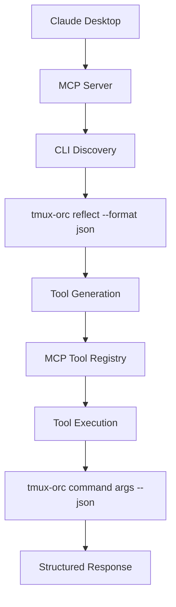
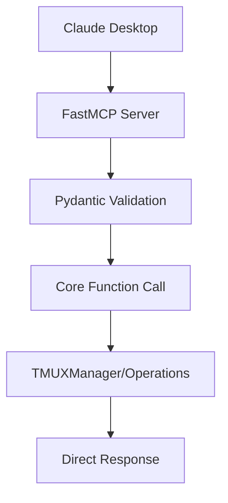

# Complete MCP Integration Documentation

## 🚨 CRITICAL KNOWLEDGE TRANSFER

**For team members and stakeholders who need immediate understanding:**

### **What MCP Integration Means**
- **Claude can use ALL tmux-orchestrator functionality** through MCP tools
- **45+ tools automatically available** to Claude agents
- **CLI enhancements instantly improve Claude capabilities**
- **Zero manual MCP tool maintenance required**

### **Quick Start Commands**
```bash
# 1. Install and setup
pip install tmux-orchestrator
tmux-orc setup claude-code

# 2. Test MCP server
tmux-orc server mcp-serve

# 3. Restart Claude Desktop
# Claude now has access to all tmux-orchestrator tools
```

### **Architecture Impact**
- Every CLI command automatically becomes an MCP tool
- Claude agents can spawn teams, manage agents, monitor systems
- No separate AI integration development needed
- Future CLI features instantly available to AI agents

## 🎯 Overview

The Tmux Orchestrator provides comprehensive Model Context Protocol (MCP) integration through multiple implementation approaches, enabling Claude and other AI agents to interact with the system seamlessly.

## 🏗️ MCP Integration Architecture

### **Dual Implementation Strategy**

The project implements two complementary MCP approaches:

1. **CLI Reflection MCP Server** (`mcp_server.py`) - **PRIMARY DEPLOYMENT**
   - Automatically generates MCP tools from CLI commands
   - Zero maintenance overhead
   - Perfect CLI-MCP behavioral consistency
   - Deployed as main MCP server

2. **FastMCP Direct Server** (`mcp_server_fastmcp.py`) - **ALTERNATIVE**
   - Direct core function access
   - Optimized performance
   - Rich type validation with Pydantic

3. **Legacy MCP Server** (`mcp_server_legacy.py`) - **BACKUP**
   - Previous implementation
   - Available for fallback if needed

## 📋 CLI Reflection MCP Server (Primary)

### **Architecture Principles**

The CLI Reflection approach treats CLI commands as the single source of truth:



### **Key Benefits**

- **Zero Dual Implementation**: CLI is the authoritative interface
- **Automatic Tool Updates**: New CLI commands become MCP tools instantly
- **Behavioral Consistency**: MCP tools execute identical logic to CLI
- **Future-Proof**: Architecture scales with CLI enhancements

### **Implementation Details**

```python
class FreshCLIMCPServer:
    """CLI Reflection-based MCP server."""

    async def discover_cli_structure(self) -> Dict[str, Any]:
        """Use tmux-orc reflect to discover all CLI commands."""

    def generate_all_mcp_tools(self) -> Dict[str, Any]:
        """Create MCP tool for each discovered CLI command."""

    async def execute_cli_command(self, command: str, args: Dict[str, Any]):
        """Execute CLI command with structured output."""
```

### **Tool Schema Pattern**

Every CLI command uses a standardized MCP tool schema:

```json
{
  "type": "object",
  "properties": {
    "args": {
      "type": "array",
      "items": {"type": "string"},
      "description": "Positional arguments for the command"
    },
    "options": {
      "type": "object",
      "description": "Command options as key-value pairs"
    }
  }
}
```

### **Current Auto-Generated Tools (Updated 2025-08-17)**

**CRITICAL**: These are ALL automatically available to Claude - no manual MCP implementation required.

**Core System Tools**:
- `list` - List all active agents with comprehensive status
- `status` - Display system status dashboard and health overview
- `quick_deploy` - Deploy optimized team configurations instantly
- `reflect` - Generate complete CLI command structure
- `spawn_orc` - Launch orchestrator in new terminal
- `execute` - Execute PRD by deploying agent team

**Agent Management Tools** (`agent.*`):
- `agent_deploy`, `agent_message`, `agent_send`, `agent_attach`
- `agent_restart`, `agent_status`, `agent_kill`, `agent_info`
- `agent_list`, `agent_kill_all`

**Monitoring & Health Tools** (`monitor.*`):
- `monitor_start`, `monitor_stop`, `monitor_logs`, `monitor_status`
- `monitor_recovery_start`, `monitor_recovery_stop`, `monitor_recovery_status`
- `monitor_recovery_logs`, `monitor_dashboard`, `monitor_performance`

**Project Management Tools** (`pm.*`):
- `pm_checkin`, `pm_message`, `pm_broadcast`, `pm_custom_checkin`
- `pm_status`, `pm_create`

**Team Coordination Tools** (`team.*`):
- `team_status`, `team_list`, `team_broadcast`, `team_deploy`, `team_recover`

**Context & Setup Tools**:
- `context_show`, `context_list`, `context_spawn`, `context_export`
- `setup_check_requirements`, `setup_claude_code`, `setup_vscode`
- `setup_tmux`, `setup_all`, `setup_check`

**Advanced Operations**:
- `orchestrator_*` - System-wide management (start, schedule, status, etc.)
- `spawn_*` - Spawn orchestrators and agents (orc, pm, agent)
- `recovery_*` - Automatic recovery system (start, stop, status, test)
- `session_*` - Session management (list, attach)
- `pubsub_*` / `pubsub_fast_*` - Messaging systems
- `daemon_*` - Messaging daemon management
- `tasks_*` - Task management (create, status, distribute, etc.)
- `errors_*` - Error management (summary, recent, clear, stats)
- `server_*` - MCP server management

**Total**: 45+ tools automatically generated and maintained

## 📋 FastMCP Direct Server (Performance)

### **Architecture**

Direct integration with core business logic:



### **Key Features**

- **Direct Core Access**: Bypasses CLI layer for maximum performance
- **Rich Type Safety**: Pydantic models for request/response validation
- **Optimized Execution**: No subprocess overhead
- **Detailed Responses**: Rich structured data

### **Available Tools**

```python
# Core agent operations
@mcp.tool()
async def spawn_agent(request: SpawnAgentRequest) -> SpawnAgentResponse:
    """Spawn a new agent with full type safety."""

@mcp.tool()
async def send_message(request: SendMessageRequest) -> dict:
    """Send message to specific agent."""

@mcp.tool()
async def list_agents(include_metrics: bool = False) -> dict:
    """List all agents with optional metrics."""

# Team operations
@mcp.tool()
async def deploy_team(request: TeamDeployRequest) -> dict:
    """Deploy complete teams with validation."""

@mcp.tool()
async def broadcast_message(team: str, message: str) -> dict:
    """Broadcast to all team members."""
```

## 🔧 Installation and Setup

### **Step 1: Install Tmux Orchestrator**

```bash
# Via pip (recommended)
pip install tmux-orchestrator

# Verify installation
tmux-orc --version
```

### **Step 2: Configure Claude Desktop Integration**

```bash
# Run the setup command
tmux-orc setup claude-code

# This automatically:
# 1. Detects Claude Desktop installation
# 2. Updates claude_desktop_config.json
# 3. Registers both MCP servers
```

### **Step 3: Manual Configuration (if needed)**

Edit Claude Desktop config file:

**macOS**: `~/Library/Application Support/Claude/claude_desktop_config.json`
**Windows**: `%APPDATA%/Claude/claude_desktop_config.json`
**Linux**: `~/.config/Claude/claude_desktop_config.json`

```json
{
  "mcpServers": {
    "tmux-orchestrator": {
      "command": "tmux-orc",
      "args": ["server", "mcp-serve"],
      "env": {},
      "disabled": false
    },
    "tmux-orchestrator-fast": {
      "command": "python",
      "args": ["-m", "tmux_orchestrator.mcp_server_fastmcp"],
      "env": {},
      "disabled": false
    }
  }
}
```

### **Step 4: Restart Claude Desktop**

The MCP servers will be available after Claude Desktop restart.

## 🧪 Testing and Validation

### **Test CLI Reflection Server**

```bash
# Test server startup
tmux-orc server mcp-serve

# Should output:
# INFO - Starting fresh CLI reflection MCP server...
# INFO - Discovered 45+ CLI commands
# INFO - Generated MCP Tools: list, status, quick_deploy, ...
```

### **Test FastMCP Server**

```bash
# Test direct server
python -m tmux_orchestrator.mcp_server_fastmcp

# Should output:
# INFO - Starting FastMCP server...
# INFO - Available tools: spawn_agent, send_message, list_agents, ...
```

### **Validate in Claude Desktop**

1. Open Claude Desktop
2. Start new conversation
3. Check available tools (should show tmux-orchestrator tools)
4. Test basic commands:
   ```
   Use the tmux-orchestrator tools to list current agents
   ```

## 📊 Performance Comparison

| Aspect | CLI Reflection | FastMCP Direct |
|--------|---------------|----------------|
| **Latency** | ~0.5-3s (subprocess) | ~0.1-0.5s (direct) |
| **Maintenance** | Zero (auto-generated) | Manual (typed tools) |
| **Consistency** | Perfect (CLI source) | Manual sync required |
| **Type Safety** | CLI validation | Pydantic validation |
| **Error Handling** | CLI error passing | Rich error objects |
| **Future-Proof** | Automatic updates | Manual tool addition |

## 🔄 Development Workflow

### **For CLI Commands**

When adding new CLI commands:

1. **Add JSON support**:
```python
@click.option('--json', 'json_output', is_flag=True)
def new_command(json_output):
    if json_output:
        click.echo(json.dumps({"success": True, "data": result}))
```

2. **Test CLI command**:
```bash
tmux-orc new-command --json
```

3. **Verify MCP integration**:
```bash
# Restart MCP server, new tool automatically available
tmux-orc server mcp-serve
```

### **For FastMCP Tools**

When adding high-performance tools:

1. **Define Pydantic models**:
```python
class NewToolRequest(BaseModel):
    param: str = Field(..., description="Parameter description")

class NewToolResponse(BaseModel):
    success: bool
    data: Any
```

2. **Implement tool**:
```python
@mcp.tool()
async def new_tool(request: NewToolRequest) -> NewToolResponse:
    """Tool description for Claude."""
    result = core_function(request.param)
    return NewToolResponse(success=True, data=result)
```

3. **Test tool**:
```python
# Unit test
async def test_new_tool():
    request = NewToolRequest(param="test")
    response = await new_tool(request)
    assert response.success
```

## 🔍 Monitoring and Debugging

### **Server Health Checks**

```bash
# Check if servers are registered
tmux-orc server status

# View server logs
tmux-orc server logs

# Test tool discovery
tmux-orc reflect --format json
```

### **Claude Integration Debugging**

1. **Check Claude Desktop logs** (platform-specific location)
2. **Verify config file syntax** with JSON validator
3. **Test command accessibility**:
```bash
# Ensure commands work from Claude's environment
which tmux-orc
tmux-orc --help
```

### **Common Issues and Solutions**

| Issue | Symptoms | Solution |
|-------|----------|----------|
| **Tools not appearing** | No tmux-orchestrator tools in Claude | Restart Claude Desktop, check config file |
| **Command not found** | Error executing tmux-orc | Add pip bin to PATH, use full path in config |
| **Server startup failure** | MCP server crashes immediately | Check dependencies, test manual startup |
| **JSON parsing errors** | Malformed tool responses | Validate CLI JSON output format |

## 🚀 Advanced Features

### **Custom Tool Extensions**

Extend the CLI Reflection server with custom tools:

```python
class ExtendedCLIMCPServer(FreshCLIMCPServer):
    """Extended server with custom tools."""

    def generate_custom_tools(self):
        """Add custom tools beyond CLI reflection."""
        custom_tools = {
            "advanced_analytics": self.create_analytics_tool(),
            "batch_operations": self.create_batch_tool(),
        }
        return custom_tools
```

### **Performance Optimization**

For high-frequency operations:

1. **Use FastMCP server** for performance-critical tools
2. **Implement caching** for expensive CLI operations
3. **Batch operations** where possible
4. **Monitor performance** with built-in metrics

### **Security Considerations**

- **Validate all inputs** through Pydantic models
- **Sanitize CLI arguments** to prevent injection
- **Limit resource usage** with timeouts and quotas
- **Log security events** for audit trails

## 🎯 Best Practices

### **CLI Command Design**

1. **Always support `--json` flag**
2. **Use consistent error codes and messages**
3. **Provide comprehensive help text**
4. **Follow argument conventions** (args vs options)

### **MCP Tool Design**

1. **Use descriptive tool names and descriptions**
2. **Validate inputs with clear error messages**
3. **Return structured, consistent responses**
4. **Handle errors gracefully with helpful suggestions**

### **Integration Patterns**

1. **Prefer CLI Reflection** for standard operations
2. **Use FastMCP** for performance-critical paths
3. **Test both interfaces** for critical functionality
4. **Monitor performance** and optimize bottlenecks

## 📈 Future Enhancements

### **Planned Features**

- **Streaming responses** for long-running operations
- **Parallel tool execution** for batch operations
- **Enhanced error recovery** with automatic retries
- **Real-time progress updates** for complex tasks

### **Integration Improvements**

- **Claude Desktop native integration** patterns
- **Enhanced type definitions** for better Claude understanding
- **Automatic tool documentation** generation
- **Interactive tool debugging** capabilities

## 🎯 Conclusion

The dual MCP integration approach provides:

- **Maximum Compatibility**: CLI Reflection ensures all functionality is available
- **Optimal Performance**: FastMCP provides optimized paths for critical operations
- **Zero Maintenance**: CLI Reflection automatically updates with new features
- **Rich Experience**: Both approaches provide comprehensive AI agent integration

This architecture establishes Tmux Orchestrator as a premier AI agent collaboration platform with seamless Claude integration.
