# TMUX Orchestrator Development Guide

## Setting Up Development Environment

### Using Dev Container (Recommended)

1. Clone the repository
2. Open in VS Code with Dev Containers extension
3. Select "Reopen in Container"
4. Poetry and all dependencies will be automatically installed

### Manual Setup

```bash
# Install Poetry
curl -sSL https://install.python-poetry.org | python3 -

# Install dependencies
poetry install

# Activate virtual environment
poetry shell
```

## Project Structure

```mermaid
graph TD
    TO[tmux-orchestrator/] --> TP[tmux_orchestrator/<br/>Main package]
    TO --> CMD[commands/<br/>Legacy bash scripts]
    TO --> BIN[bin/<br/>Generic scripts]
    TO --> TEST[tests/<br/>Test suite]
    TO --> DOCS[docs/<br/>Documentation]
    TO --> PY[pyproject.toml<br/>Project configuration]

    TP --> CLI[cli/<br/>CLI commands]
    TP --> CORE[core/<br/>Core functionality]
    TP --> SERVER[server/<br/>MCP server]
    TP --> SDK[sdk/<br/>Agent SDK]
    TP --> UTILS[utils/<br/>Utilities]

    CLI --> CLII[__init__.py<br/>Main CLI entry point]
    CLI --> AGENT[agent.py<br/>Agent management commands]
    CLI --> MONITOR[monitor.py<br/>Monitoring commands]
    CLI --> ORC[orchestrator.py<br/>Orchestrator commands]
    CLI --> PM[pm.py<br/>PM-specific commands]

    CORE --> AM[agent_manager.py<br/>Agent lifecycle management]
    CORE --> CONFIG[config.py<br/>Configuration handling]
    CORE --> DEP[deployer.py<br/>Team deployment logic]
    CORE --> MON[monitor.py<br/>Idle monitoring]
    CORE --> PMM[pm_manager.py<br/>PM operations]

    SERVER --> SI[__init__.py<br/>FastAPI app]
    SERVER --> ROUTES[routes/<br/>API endpoints]
    SERVER --> MODELS[models/<br/>Pydantic models]

    SDK --> SDKI[__init__.py<br/>Agent class]
    UTILS --> TMUX[tmux.py<br/>TMUX wrapper]

    classDef root fill:#e3f2fd
    classDef package fill:#e8f5e8
    classDef module fill:#fff3e0
    classDef file fill:#f3e5f5

    class TO root
    class TP,CLI,CORE,SERVER,SDK,UTILS package
    class CMD,BIN,TEST,DOCS,ROUTES,MODELS module
    class CLII,AGENT,MONITOR,ORC,PM,AM,CONFIG,DEP,MON,PMM,SI,SDKI,TMUX,PY file
```



## Development Workflow

### 1. Running the CLI in Development

```bash
# Install in editable mode
poetry install

# Run CLI directly
poetry run tmux-orc --help

# Or activate shell and run
poetry shell
tmux-orc --help
```

### 2. Running the MCP Server

```bash
# Start the server
poetry run tmux-orc-server

# Or with custom settings
poetry run uvicorn tmux_orchestrator.server:app --reload --host 0.0.0.0 --port 8000
```

### 3. Testing

```bash
# Run all tests
poetry run pytest

# Run with coverage
poetry run pytest --cov=tmux_orchestrator

# Run specific test
poetry run pytest tests/test_agent_manager.py
```

### 4. Code Quality

```bash
# Format code
poetry run black tmux_orchestrator

# Lint code
poetry run ruff check tmux_orchestrator

# Type checking
poetry run mypy tmux_orchestrator
```

## Implementation Status

### ✅ Completed
- [x] CLI framework with Click
- [x] Basic command structure
- [x] Configuration system
- [x] TMUX wrapper utilities
- [x] Agent manager core
- [x] PM manager core
- [x] SDK for agents
- [x] MCP server framework

### 🚧 In Progress
- [ ] Team deployer implementation
- [ ] Monitor daemon integration
- [ ] Recovery system
- [ ] Scheduler implementation

### 📋 TODO
- [ ] MCP server routes implementation
- [ ] Database for agent state
- [ ] WebSocket support for real-time updates
- [ ] Web dashboard
- [ ] Agent metrics and analytics
- [ ] Plugin system for custom agents
- [ ] Integration tests
- [ ] Documentation site

## Key Implementation Files

### Adding a New CLI Command

1. Create command module in `cli/`
2. Define Click group/commands
3. Import and add to main CLI in `cli/__init__.py`

Example:
```python
# cli/newfeature.py
import click

@click.group()
def newfeature():
    """New feature commands."""
    pass

@newfeature.command()
def action():
    """Perform action."""
    click.echo("Action performed!")

# In cli/__init__.py
from tmux_orchestrator.cli import newfeature
cli.add_command(newfeature.newfeature)
```

### Adding MCP Endpoints

1. Create route module in `server/routes/`
2. Define FastAPI router
3. Include in main app in `server/__init__.py`

Example:
```python
# server/routes/custom.py
from fastapi import APIRouter

router = APIRouter()

@router.get("/custom/endpoint")
async def custom_endpoint():
    return {"status": "ok"}

# In server/__init__.py
from tmux_orchestrator.server.routes import custom
app.include_router(custom.router, prefix="/custom", tags=["custom"])
```

## Testing Guidelines

1. **Unit Tests**: Test individual components in isolation
2. **Integration Tests**: Test CLI commands with mock TMUX
3. **E2E Tests**: Test full workflows with real TMUX sessions

## Contributing

1. Create feature branch from `main`
2. Implement changes with tests
3. Ensure all checks pass (format, lint, type check, tests)
4. Submit PR with clear description

## Debugging Tips

1. **CLI Debugging**:
   ```bash
   # Enable debug output
   export TMUX_ORCHESTRATOR_DEBUG=1
   tmux-orc command
   ```

2. **Server Debugging**:
   ```bash
   # Run with debug logging
   uvicorn tmux_orchestrator.server:app --log-level debug
   ```

3. **TMUX Issues**:
   ```bash
   # Check TMUX server
   tmux list-sessions

   # Debug TMUX commands
   export TMUX_DEBUG=1
   ```

## Release Process

1. Update version in `pyproject.toml`
2. Update CHANGELOG.md
3. Create git tag: `git tag v2.0.0`
4. Build: `poetry build`
5. Publish: `poetry publish`
