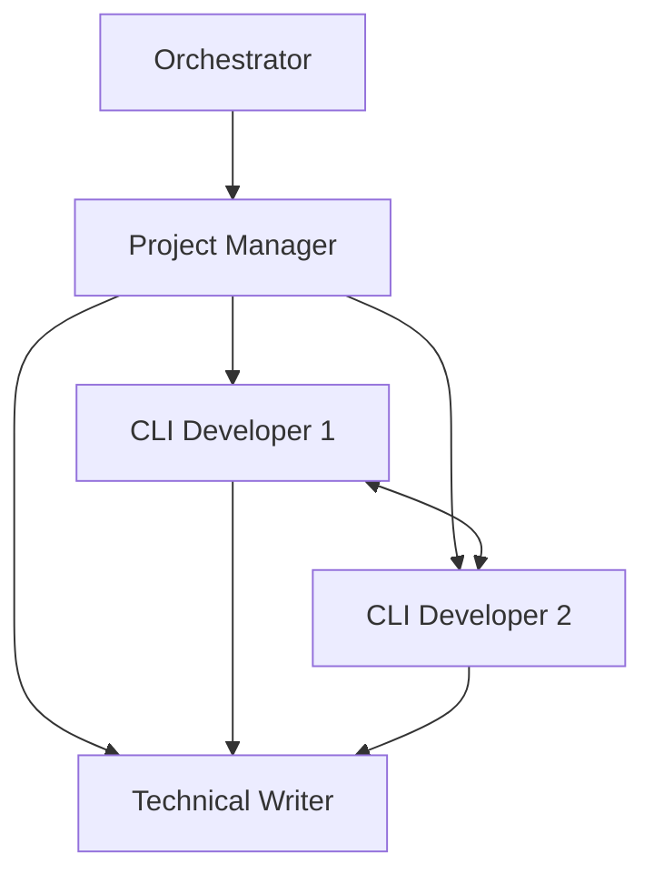

# Dynamic Team Composition

The Tmux Orchestrator supports flexible team composition based on project requirements, moving beyond fixed team templates to optimize resource utilization and expertise matching.

## Overview

Instead of deploying standard teams (frontend, backend, fullstack), the orchestrator analyzes your PRD to determine the optimal team composition for your specific project.

## How It Works

### 1. PRD Analysis
When you execute a PRD, the system analyzes:
- Technology requirements
- Project type (API, CLI, web app, etc.)
- Security needs
- Documentation requirements
- Testing complexity

### 2. Team Planning
Based on analysis, the system suggests a custom team:
```bash
tmux-orc execute ./prd.md
# OR manually compose:
tmux-orc team compose my-project --prd ./prd.md
```

### 3. Team Documentation
Each project gets a `team-composition.md` file that includes:
- Agent roles and specializations
- Interaction diagrams (Mermaid)
- Recovery information
- Communication protocols
- Quality standards

## Agent Templates

Available agent types are defined in `.tmux_orchestrator/agent-templates/`:

### Development Agents
- `frontend-developer.yaml` - UI/UX implementation
- `backend-developer.yaml` - Server-side development
- `cli-developer.yaml` - Command-line interfaces
- `api-designer.yaml` - API architecture
- `database-engineer.yaml` - Data layer design

### Quality & Testing
- `qa-engineer.yaml` - Manual testing
- `test-automation.yaml` - Automated tests
- `security-tester.yaml` - Security validation
- `performance-engineer.yaml` - Performance optimization

### Specialized Roles
- `technical-writer.yaml` - Documentation
- `devops-engineer.yaml` - Infrastructure
- `security-engineer.yaml` - Security implementation
- `solution-architect.yaml` - System design

### Management
- `project-manager.yaml` - Coordination & quality
- `technical-lead.yaml` - Technical PM
- `scrum-master.yaml` - Agile processes

## Example Team Compositions

### API-Heavy Project
```yaml
agents:
  - Project Manager (coordination)
  - API Designer (architecture)
  - 2 Backend Developers (implementation)
  - Database Engineer (data layer)
  - Test Automation Engineer (API testing)
```

### CLI Tool Project
```yaml
agents:
  - Technical Lead (PM + coding)
  - 2 CLI Developers (interface & functionality)
  - Technical Writer (documentation)
  - QA Engineer (usability testing)
```

### Security-Critical Project
```yaml
agents:
  - Project Manager (compliance)
  - Security Engineer (threat modeling)
  - 2 Backend Developers (secure implementation)
  - Security Tester (penetration testing)
  - DevOps Engineer (secure deployment)
```

## Team Interaction Models

Each team composition includes a Mermaid diagram showing:
- Reporting relationships
- Communication patterns
- Work dependencies
- Escalation paths

Example:


## Recovery and Resilience

Team composition documents enable graceful recovery:

### Agent Crash Recovery
```bash
# Check team composition
cat .tmux_orchestrator/projects/my-project/team-composition.md

# Restart crashed agent with proper configuration
tmux-orc agent restart my-project:2 --template backend-developer \
  --customize "Specialized in database migrations"
```

### Session Recovery
The team composition file contains:
- Exact agent configurations
- System prompts used
- Task assignments
- Project context

## Benefits

1. **Resource Efficiency**: No unnecessary agents
2. **Specialized Expertise**: Right skills for each project
3. **Better Communication**: Fewer agents, clearer paths
4. **Quality Outcomes**: Specialized agents deliver better results
5. **Flexibility**: Adapt to any project type

## Commands

### Compose a Team
```bash
# Interactive composition
tmux-orc team compose my-project --interactive

# From PRD analysis
tmux-orc team compose my-project --prd ./prd.md

# Using template
tmux-orc team compose my-project --template api-heavy
```

### Deploy Custom Team
```bash
# Deploy from composition
tmux-orc team deploy my-project --custom

# Or use execute command (includes composition)
tmux-orc execute ./prd.md
```

### List Available Templates
```bash
tmux-orc team list-templates
```

## Creating Custom Agent Templates

To add new agent types:

1. Create YAML file in `.tmux_orchestrator/agent-templates/`
2. Define:
   - role
   - specialization
   - skills
   - prompt
   - quality_standards
   - communication patterns

Example:
```yaml
role: "API Designer"
specialization: "RESTful and GraphQL API architecture"
skills:
  - RESTful principles
  - GraphQL schema design
  - OpenAPI specification
  - Authentication patterns
prompt: |
  You are an API Designer specializing in creating
  well-architected, developer-friendly APIs...
```

## Best Practices

1. **Analyze Before Deploying**: Let the system suggest optimal composition
2. **Document Customizations**: Record why specific agents were chosen
3. **Monitor Team Health**: Use `tmux-orc team status` regularly
4. **Iterate**: Adjust team composition as project evolves
5. **Reuse Patterns**: Save successful compositions as templates
