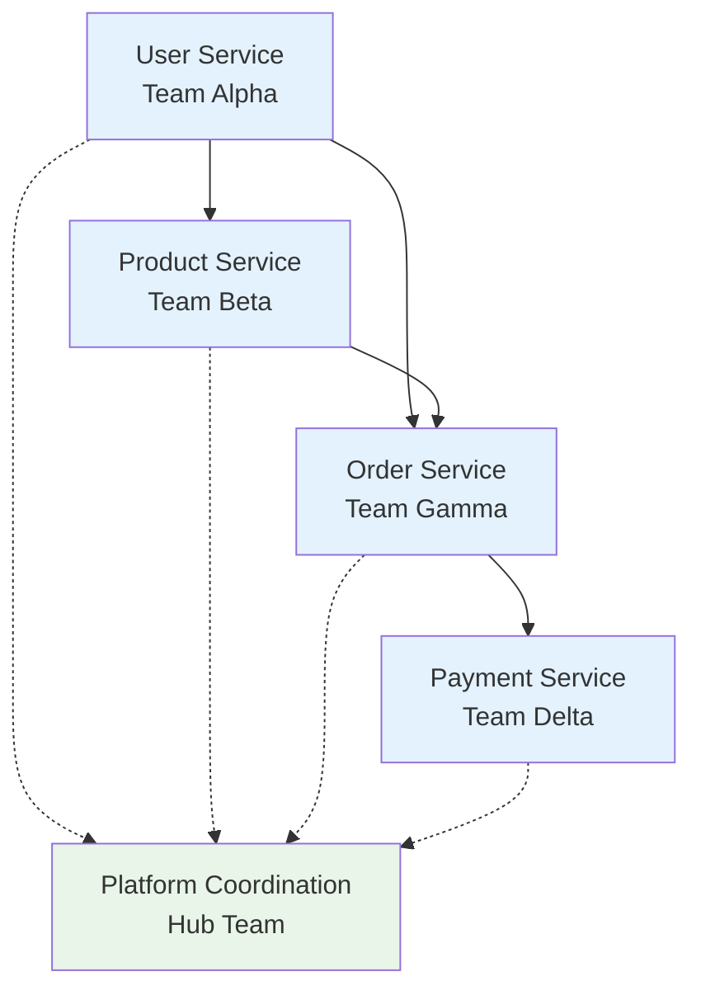

# Example: Distributed Microservices Development

This example demonstrates how to use TMUX Orchestrator to manage multiple teams working on different microservices simultaneously.

## Scenario

You're building a microservices-based e-commerce platform with separate services for users, products, orders, and payments. Each service needs its own specialized team.

## Architecture Overview



## Step 1: Deploy Service Teams

```bash
# Deploy specialized teams for each microservice
tmux-orc team deploy user-service backend 4
tmux-orc team deploy product-service backend 4
tmux-orc team deploy order-service backend 5
tmux-orc team deploy payment-service backend 5

# Deploy coordination team
tmux-orc team deploy platform-coordination fullstack 3
```

## Step 2: Configure Inter-Team Communication

```bash
# Set up communication channels
tmux-orc team link user-service product-service order-service payment-service \
  --hub platform-coordination \
  --communication-mode async

# Configure service dependencies
tmux-orc pm configure-dependencies \
  --service order-service \
  --depends-on user-service,product-service,payment-service
```

## Step 3: Distribute Service Specifications

Create service contracts for each team:

```yaml
# user-service-spec.yaml
service: user-service
api_version: v1
endpoints:
  - GET /users/{id}
  - POST /users
  - PUT /users/{id}
  - DELETE /users/{id}
  - POST /users/authenticate
events:
  publishes:
    - user.created
    - user.updated
    - user.deleted
  subscribes:
    - order.completed
```

```bash
# Distribute specs to teams
tmux-orc team broadcast user-service \
  "Service specification available at /specs/user-service-spec.yaml"
```

## Step 4: Coordinate API Development

The platform coordination team manages API contracts:

```
Platform PM > "API Gateway configuration:
  /api/users/* → user-service:8001
  /api/products/* → product-service:8002
  /api/orders/* → order-service:8003
  /api/payments/* → payment-service:8004"

Platform PM > "All teams: Please implement health check endpoints by EOD"
```

## Step 5: Implement Cross-Service Features

### Example: Order Creation Flow

```bash
# PM coordinates cross-service feature
tmux-orc pm coordinate-feature platform-coordination \
  --feature "order-creation" \
  --involves "user-service,product-service,order-service,payment-service"
```

Automatic coordination happens:

```
Platform PM > "Coordinating order creation feature:
  1. User Service: Validate user exists and has permissions
  2. Product Service: Check inventory and reserve items
  3. Order Service: Create order record
  4. Payment Service: Process payment
  5. All: Handle rollback on any failure"

Order Service PM > "We'll implement saga pattern for distributed transactions"
Payment Service PM > "Adding idempotency keys to prevent double charges"
```

## Step 6: Service Integration Testing

```bash
# Run cross-service integration tests
tmux-orc execute test-suite integration-tests \
  --services all \
  --parallel

# Monitor test execution across teams
tmux-orc monitor dashboard --filter "test-execution"
```

## Step 7: Service Mesh Deployment

```bash
# Deploy services to development environment
tmux-orc pm deploy-services platform-coordination \
  --environment dev \
  --strategy rolling

# DevOps agents handle deployment
User Service DevOps > "Deploying user-service:v1.2.3 to dev cluster"
Product Service DevOps > "Health checks passing, starting traffic shift"
```

## Real-Time Service Monitoring

```bash
# Monitor all services
tmux-orc monitor services --real-time

# Service Health Dashboard:
# ┌─────────────────┬──────────┬─────────┬──────────┐
# │ Service         │ Status   │ Latency │ Errors   │
# ├─────────────────┼──────────┼─────────┼──────────┤
# │ user-service    │ ✅ OK    │ 23ms    │ 0.01%    │
# │ product-service │ ✅ OK    │ 45ms    │ 0.02%    │
# │ order-service   │ ⚠️ WARN  │ 234ms   │ 0.5%     │
# │ payment-service │ ✅ OK    │ 67ms    │ 0.00%    │
# └─────────────────┴──────────┴─────────┴──────────┘
```

## Handling Service Dependencies

### Automatic Dependency Resolution

```python
# Platform PM's dependency management
def check_service_dependencies():
    dependencies = {
        "order-service": ["user-service", "product-service", "payment-service"],
        "payment-service": ["user-service"],
        "notification-service": ["user-service", "order-service"]
    }

    for service, deps in dependencies.items():
        for dep in deps:
            if not is_service_ready(dep):
                notify_team(service, f"Waiting for {dep} to be ready")
                delay_deployment(service)
```

### Contract Testing

```bash
# Each team runs contract tests
tmux-orc pm run-contract-tests user-service \
  --consumers "order-service,payment-service"

# Results:
User Service QA > "Contract tests results:
  ✅ order-service: All 15 contracts passing
  ❌ payment-service: 1 contract failing (missing email field)"
```

## Cross-Team Communication Patterns

### Synchronous Updates
```bash
# Broadcast critical updates to all teams
tmux-orc team broadcast-all \
  "ATTENTION: API Gateway switching to new auth tokens at 3 PM UTC"
```

### Asynchronous Coordination
```bash
# Leave messages for specific teams
tmux-orc team message payment-service \
  --from user-service \
  "Updated user schema now includes 'preferred_payment_method' field"
```

### Service Status Reports
```bash
# Generate cross-service status report
tmux-orc pm report platform-coordination --type service-mesh

## Service Mesh Status Report

### Service Versions
- user-service: v2.1.0 (stable)
- product-service: v1.9.2 (stable)
- order-service: v3.0.0-beta (testing)
- payment-service: v2.5.1 (stable)

### Inter-Service Communication (Last 24h)
- user → order: 45,231 calls (99.9% success)
- order → payment: 12,455 calls (99.7% success)
- order → product: 34,122 calls (99.8% success)

### Pending Cross-Service Tasks
- Implement distributed tracing
- Add circuit breakers for payment service
- Upgrade to new message format
```

## Handling Service Failures

### Automatic Failover
```bash
# Configure automatic failover
tmux-orc recovery configure \
  --service-mode \
  --failover-strategy active-passive \
  --health-check-interval 10s
```

### Cascading Failure Prevention
```
Platform PM > "Order service experiencing high latency. Implementing:
  1. Circuit breaker activation
  2. Request rate limiting
  3. Fallback to cache for product data
  4. Graceful degradation for non-critical features"
```

## Performance Optimization Across Services

```bash
# Run performance analysis
tmux-orc monitor performance --mode distributed

# Optimization recommendations:
Platform PM > "Performance bottlenecks identified:
  1. User service: Add caching for auth tokens
  2. Product service: Optimize database queries
  3. Order service: Implement pagination
  4. Payment service: Add connection pooling"
```

## End-to-End Testing

```bash
# Create E2E test scenarios
tmux-orc execute e2e-test scenarios/purchase-flow.yaml

# Test execution across services:
E2E Test > "Running purchase flow:
  ✅ User login successful
  ✅ Product search returned results
  ✅ Add to cart successful
  ✅ Checkout initiated
  ✅ Payment processed
  ✅ Order confirmation sent
  ✅ Inventory updated

  Total time: 1.2s (✅ within SLA)"
```

## Deployment Coordination

```bash
# Coordinate multi-service deployment
tmux-orc pm deploy platform-coordination \
  --services "user-service,order-service" \
  --strategy "blue-green" \
  --rollback-on-failure

# Deployment sequence:
Platform PM > "Deployment plan:
  1. Deploy user-service (no breaking changes)
  2. Wait for health checks
  3. Deploy order-service (depends on user-service v2.1)
  4. Run smoke tests
  5. Switch traffic (blue → green)
  6. Monitor for 10 minutes
  7. Cleanup old versions"
```

## Best Practices for Microservices

1. **API Versioning**: Always version APIs to prevent breaking changes
2. **Service Isolation**: Each team owns their service completely
3. **Contract First**: Define APIs before implementation
4. **Async by Default**: Use event-driven architecture where possible
5. **Observability**: Implement comprehensive logging and tracing

## Common Patterns

### Service Discovery
```bash
# Register services automatically
tmux-orc service register user-service \
  --port 8001 \
  --health-check "/health"
```

### Message Queue Integration
```bash
# Configure event streaming
tmux-orc pm configure-events platform-coordination \
  --broker "kafka" \
  --topic-prefix "ecommerce"
```

### API Gateway Management
```bash
# Update routing rules
tmux-orc pm update-routes platform-coordination \
  --add "/api/v2/users:user-service-v2" \
  --deprecate "/api/v1/users"
```

## Results

After implementing microservices architecture:
- 🚀 Independent deployments: 10x faster
- 📈 Service scalability: Horizontal scaling per service
- 🛡️ Fault isolation: Service failures don't cascade
- 👥 Team autonomy: Parallel development
- 🔄 Technology flexibility: Different stacks per service
