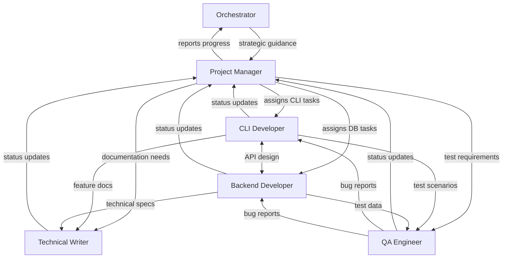

# Flexible Team Composition Example

This example demonstrates how the Tmux Orchestrator dynamically composes teams based on project requirements.

## Scenario: Building a CLI Tool for Database Migrations

### 1. Project Description

```markdown
# Database Migration CLI Tool

We need a command-line tool for managing database migrations with:
- Interactive migration creation
- Version control integration
- Rollback capabilities
- Multi-database support (PostgreSQL, MySQL, SQLite)
- Comprehensive documentation
- Automated testing
```

### 2. Team Composition Analysis

Based on the PRD, the orchestrator determines this is a CLI-heavy project requiring:
- Strong CLI development expertise
- Database knowledge
- Documentation focus
- No frontend needs

### 3. Recommended Team Composition

```yaml
# Team for CLI Database Migration Tool

agents:
  - role: "Project Manager"
    template: "project-manager"
    window: 0
    focus: "CLI project coordination and quality"
    
  - role: "CLI Developer"
    template: "cli-developer"
    window: 1
    focus: "Command structure and user interface"
    responsibilities:
      - Design command hierarchy
      - Implement interactive prompts
      - Create progress indicators
      - Ensure cross-platform compatibility
    
  - role: "Backend Developer"
    template: "backend-developer"  
    window: 2
    focus: "Database operations and migration logic"
    customization: "Specialized in database migrations"
    responsibilities:
      - Implement migration engine
      - Database adapter pattern
      - Transaction management
      - Schema versioning
    
  - role: "Technical Writer"
    template: "technical-writer"
    window: 3
    focus: "CLI documentation and examples"
    responsibilities:
      - Write comprehensive CLI docs
      - Create migration tutorials
      - Document database-specific features
      - Maintain changelog
    
  - role: "QA Engineer"
    template: "qa-engineer"
    window: 4
    focus: "CLI testing and database verification"
    responsibilities:
      - Test all CLI commands
      - Verify database operations
      - Cross-platform testing
      - Edge case validation
```

### 4. Team Interaction Model



### 5. Execution Command

```bash
# Execute with custom team composition
tmux-orc execute ./prd-db-migration-cli.md --project-name db-cli

# This will:
# 1. Create project structure
# 2. Analyze PRD and suggest this team
# 3. Deploy the 5-agent team
# 4. Brief each agent with specialized prompts
# 5. Start development workflow
```

### 6. Alternative Team Compositions

#### For API-First Version:
```yaml
agents:
  - Project Manager
  - API Designer (instead of CLI Developer)
  - 2 Backend Developers
  - Test Automation Engineer
```

#### For Enterprise Version:
```yaml
agents:
  - Project Manager
  - CLI Developer
  - Backend Developer
  - Security Engineer
  - DevOps Engineer
  - Technical Writer
```

### 7. Benefits of Flexible Composition

1. **Resource Optimization**: No wasted agents on unnecessary roles
2. **Specialized Expertise**: Right experts for specific needs
3. **Better Communication**: Fewer agents = clearer communication
4. **Focused Development**: Each agent has clear responsibilities
5. **Quality Outcomes**: Specialized agents deliver better results

### 8. Recovery Information

If any agent crashes, the `team-composition.md` file contains:
- Exact agent configuration
- System prompts used
- Current task assignments
- Recovery commands

Example recovery:
```bash
# Check crashed agent
tmux-orc recovery check --session db-cli

# Restart with proper prompt
tmux-orc agent restart db-cli:2 --template backend-developer \
  --customize "Specialized in database migrations"
```

## Key Takeaways

- Teams are composed based on project needs, not fixed templates
- Orchestrator/PM analyzes PRD to determine optimal team
- Each agent gets project-specific customizations
- Team composition is documented for transparency and recovery
- Flexibility leads to better resource utilization and outcomes