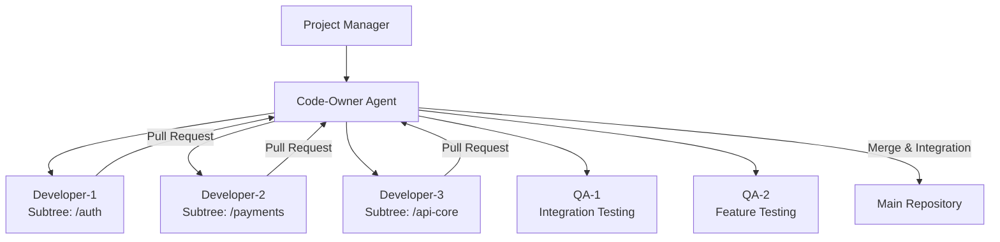

# PRD: Horizontal Agent Scaling with Code-Owner Architecture

**Status**: Future Enhancement - Not for immediate implementation
**Priority**: P2 - After basic functionality is stable
**Dependencies**: GitHub MCP integration, stable core agent coordination

## Problem Statement

Current tmux-orchestrator works well with **vertical team scaling** (1 PM + 1 Backend + 1 Frontend + 1 QA), but struggles with **horizontal scaling** where multiple agents work on the same stack component:

### **Coordination Conflicts:**
- Multiple backend developers committing to same files
- Duplicate work on similar features
- Merge conflicts from simultaneous development
- No clear ownership or coordination strategy

### **Quality Control Issues:**
- No unified code review process for horizontally scaled agents
- Inconsistent coding standards across parallel work streams
- Risk of architectural drift with multiple agents making independent decisions

## Proposed Solution: Code-Owner Agent Architecture

### **Core Concept:**
Add a **Code-Owner Agent** that acts as coordination layer for horizontal scaling, using **git subtrees** for work isolation and **GitHub MCP** for integration management.



### **Key Components:**

#### **1. Code-Owner Agent Role**
- **Subtree Assignment**: Assigns isolated work areas to agents
- **Integration Management**: Merges completed work into main codebase
- **Quality Gatekeeper**: Ensures code standards and architectural consistency
- **Conflict Resolution**: Handles merge conflicts and integration issues
- **Performance Oversight**: Monitors parallel work streams for efficiency

#### **2. Git Subtree Isolation**
```bash
# Code-owner assigns subtrees
git subtree push --prefix=src/auth auth-team main
git subtree push --prefix=src/payments payments-team main
```

#### **3. GitHub MCP Integration**
- **Automated PR Creation**: Agents create PRs for their subtree work
- **Code Review Orchestration**: Code-owner reviews and approves PRs
- **CI/CD Coordination**: Manages build/test pipelines across subtrees
- **Issue Tracking**: Links agent work to specific GitHub issues

## User Experience

### **Team Creation with Horizontal Scaling**
```bash
# Create team with multiple backend developers
tmux-orc team compose ecommerce --use-code-owners --horizontal-scale

# This creates:
# - 1 PM (coordination)
# - 1 Code-Owner (integration management)
# - 3 Backend Developers (assigned to different subtrees)
# - 2 QA Engineers (integration + feature testing)
```

### **Automatic Subtree Assignment**
```bash
# Code-owner automatically assigns work areas
Code-Owner: "Assigning subtrees based on PRD requirements:
- Developer-1: /src/authentication (login, signup, sessions)
- Developer-2: /src/payments (stripe, billing, invoices)
- Developer-3: /src/api-core (routing, middleware, validation)

Each agent will work in isolated subtree with own git branch."
```

### **Integration Workflow**
```bash
# Developer completes work
Developer-1: "Authentication module complete. Creating PR for subtree."

# Code-owner reviews and integrates
Code-Owner: "Reviewing auth subtree PR... Code quality ✓, Tests ✓,
Integration tests ✓. Merging to main and updating other agents."
```

## Technical Requirements

### **GitHub MCP Integration**
- **Repository Management**: Create/manage subtree repositories
- **PR Automation**: Automated pull request creation and management
- **Code Review**: Programmatic code review and approval workflows
- **Issue Linking**: Connect agent work to GitHub issues
- **CI/CD Integration**: Trigger builds/tests for subtree changes

### **CLI Enhancements**
```bash
# New CLI commands
tmux-orc code-owner spawn project:0          # Create code-owner agent
tmux-orc code-owner assign developer-1 /auth # Assign subtree
tmux-orc code-owner status                   # Show all assignments
tmux-orc code-owner merge developer-1        # Merge completed work
tmux-orc agent spawn developer project:2 --use-code-owners --subtree /auth
```

### **Agent Context Updates**
- **Code-Owner Context**: Specialized prompt for integration management
- **Subtree-Aware Developer Context**: Agents understand their work boundaries
- **Integration Testing Context**: QA agents focus on cross-subtree integration

## Success Metrics

### **Coordination Efficiency**
- **Reduced Merge Conflicts**: <5% conflict rate vs current 30%+
- **Parallel Work Effectiveness**: Multiple agents working simultaneously without blocking
- **Clear Work Boundaries**: No duplicate or overlapping effort

### **Code Quality**
- **Consistent Standards**: Unified code review process across all parallel work
- **Architectural Integrity**: No architectural drift from independent agent decisions
- **Integration Reliability**: Seamless integration of parallel work streams

### **Development Velocity**
- **Horizontal Scaling Effectiveness**: 3 backend agents = 2.5x velocity (not 3x due to coordination overhead)
- **Time to Integration**: <1 hour from PR creation to main branch merge
- **Quality Gate Efficiency**: Automated quality checks reduce manual review time

## Implementation Phases

### **Phase 1: GitHub MCP Foundation**
- Set up GitHub MCP integration
- Basic repository and PR management
- Code review automation

### **Phase 2: Subtree Management**
- Git subtree creation and management
- Automated branch/subtree assignment
- Basic integration workflows

### **Phase 3: Code-Owner Agent**
- Specialized code-owner agent role
- Integration management capabilities
- Quality gatekeeper functionality

### **Phase 4: Full Horizontal Scaling**
- Multi-agent subtree coordination
- Advanced conflict resolution
- Performance monitoring and optimization

## Risks & Mitigations

### **Integration Complexity**
- **Risk**: Complex merge conflicts between subtrees
- **Mitigation**: Clear API boundaries, automated integration testing

### **Coordination Overhead**
- **Risk**: Code-owner becomes bottleneck
- **Mitigation**: Automated quality checks, clear approval criteria

### **GitHub API Limits**
- **Risk**: Rate limiting with multiple agents creating PRs
- **Mitigation**: Request batching, GitHub Apps authentication

## Future Enhancements

- **Multi-Repository Support**: Scale across multiple repos
- **Advanced Conflict Resolution**: AI-powered merge conflict resolution
- **Performance Analytics**: Detailed metrics on horizontal scaling effectiveness
- **Custom Subtree Strategies**: Project-specific work area assignments

---

**Note**: This PRD is for future implementation after core tmux-orchestrator functionality is stable and proven. Focus on vertical scaling and basic coordination before attempting horizontal scaling complexity.
