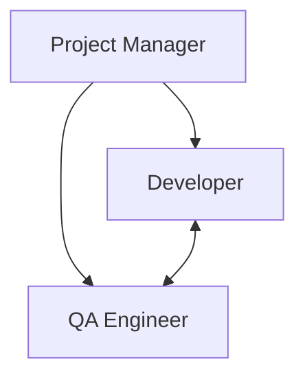
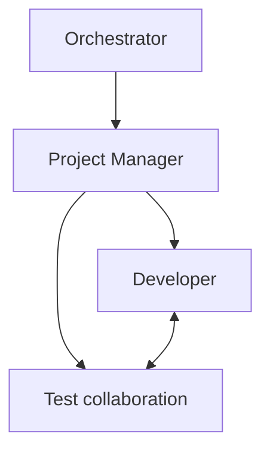
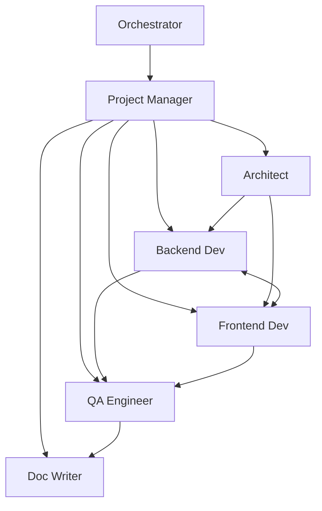

# Team Planning Guide

## Team Planning Principles

Your team plans should be:
- **Bespoke**: Custom-designed for each project's needs
- **Clear**: Specific roles and responsibilities
- **Practical**: Achievable with available agent types
- **Flexible**: Allow PM autonomy in execution

## Team Plan Structure

### Required Sections

```markdown
# Team Plan - [Project Name]

## Project Overview
Brief description of what we're building and why

## Objectives
1. Primary objective
2. Secondary objectives
3. Quality requirements

## Team Composition
### Required Agents
- **Project Manager**: Window 1
  - Role: Overall coordination and quality enforcement
  - Focus: [Specific areas]

- **[Agent Type]**: Window 2
  - Role: [Primary responsibility]
  - Focus: [Specific areas]
  - Key Skills: [Required expertise]

### Optional Agents (PM discretion)
- Additional roles the PM may spawn if needed

## Task Breakdown
### Phase 1: [Name]
1. Specific task with success criteria
2. Another task with dependencies

### Phase 2: [Name]
[Continue breakdown]

## Individual Agent Briefings
### PM Briefing
"You are managing [project type]. Key priorities:
- [Priority 1]
- [Priority 2]
Review the full plan and spawn agents as specified."

### [Agent] Briefing
"You are a [role] working on [project]. Focus on:
- [Specific responsibility]
- [Quality standards]
- [Collaboration needs]"

## Interaction Model


## Success Criteria
- [ ] All tests passing
- [ ] Code coverage > 80%
- [ ] Documentation updated
- [ ] Pre-commit hooks passing

## Risk Mitigation
- Risk: [Potential issue]
  - Mitigation: [How to handle]

## Recovery Information
If agents crash or need recovery:
- [Specific recovery steps]
- [Context to preserve]
```

## Agent Selection Guidelines

### For Software Projects

**Core Team** (most projects):
- PM (always)
- 1-2 Developers
- 1 QA Engineer

**Extended Team** (complex projects):
- + DevOps Engineer
- + Technical Architect
- + Documentation Writer

### For Non-Software Projects

**Writing Projects**:
- PM
- Content Writers
- Editors
- Fact Checkers

**Research Projects**:
- PM
- Researchers
- Data Analysts
- Report Writers

**Creative Projects**:
- PM
- Creative Directors
- Designers
- Reviewers

## Common Team Patterns

### Small Fix/Enhancement
```
- PM: Coordination
- Developer: Implementation
- QA: Verification
```

### New Feature Development
```
- PM: Coordination
- Architect: Design
- Developer 1: Backend
- Developer 2: Frontend
- QA: Testing
```

### Bug Investigation
```
- PM: Coordination
- Senior Developer: Root cause analysis
- QA: Reproduction and verification
```

### Documentation Project
```
- PM: Coordination
- Technical Writer: Documentation
- Developer: Technical review
```

## Task Breakdown Best Practices

### Good Task Definition
✅ "Implement user authentication with JWT tokens, including login/logout endpoints and session management"
- Clear scope
- Specific deliverables
- Measurable outcome

### Poor Task Definition
❌ "Work on auth stuff"
- Vague scope
- No clear deliverable
- Unmeasurable

### Task Dependencies
Clearly indicate dependencies:
```
Task 2: Implement user profile endpoints
  Depends on: Task 1 (User model)
  Blocks: Task 4 (Profile UI)
```

## Agent Briefing Templates

### Developer Briefing
```
You are a [Frontend/Backend/Full-Stack] Developer working on [project].

Technical Stack:
- Language: [Python/JavaScript/etc]
- Framework: [Django/React/etc]
- Testing: [pytest/jest/etc]

Your Responsibilities:
1. [Primary responsibility]
2. [Secondary responsibility]

Quality Standards:
- 80% test coverage minimum
- All pre-commit hooks must pass
- Follow existing code patterns

Collaboration:
- Coordinate with QA on test strategy
- Update PM on progress every 30 minutes
```

### QA Engineer Briefing
```
You are a QA Engineer ensuring quality for [project].

Testing Scope:
- Unit tests for new features
- Integration tests for APIs
- Regression tests for bug fixes

Tools:
- Testing: [pytest/jest/etc]
- Coverage: [coverage.py/etc]

Standards:
- 80% coverage minimum
- All tests must pass
- Document test scenarios
```

## Mermaid Diagrams for Interaction

### Simple Team


### Complex Team


## Plan Validation Checklist

Before providing plan to PM:
- [ ] Clear project objectives
- [ ] Appropriate team size (3-6 agents)
- [ ] Specific role definitions
- [ ] Detailed task breakdown
- [ ] Individual briefings for each role
- [ ] Success criteria defined
- [ ] Interaction model documented
- [ ] Recovery procedures included

Remember: A good plan enables PM autonomy while ensuring project success!
